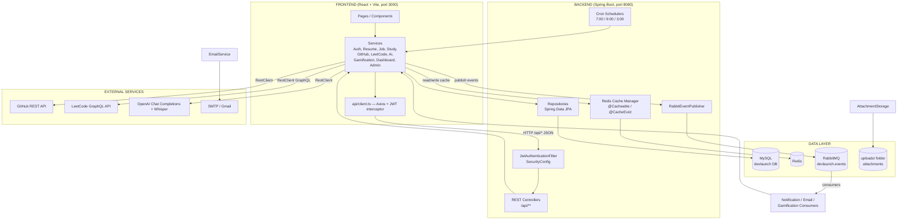
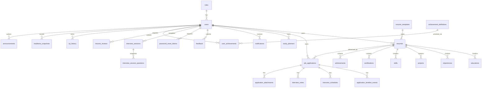
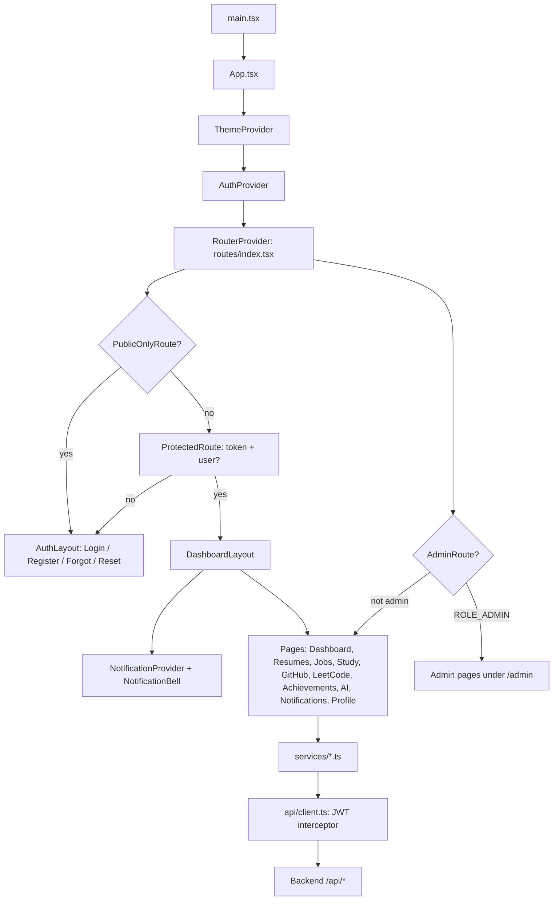

# DEVLAUNCH — COMPLETE TECHNICAL DOCUMENTATION

> **Author's note:** This document was produced by studying the **entire actual codebase** (backend Java sources, frontend React sources, configuration files, dependency files, seed data, tests, and design docs in `docs/`). Nothing here is guessed from the product idea. Every class, endpoint, table, and configuration item below exists in the code.
>
> **Legend used throughout:**
> - ✅ **ACTUALLY IMPLEMENTED** — verified in code
> - 🟡 **PARTIALLY IMPLEMENTED** — some parts exist, others do not
> - 🔴 **NOT IMPLEMENTED / PLANNED** — mentioned in docs/plans but not found in code
> - 🔵 **ENHANCED BEYOND ORIGINAL PLAN** — implemented beyond what the design docs describe

---

## TABLE OF CONTENTS

1. [Complete Project Overview](#1-complete-project-overview)
2. [Technology Stack](#2-technology-stack)
3. [Project Folder Structure](#3-project-folder-structure)
4. [Configuration Files](#4-configuration-files)
5. [Dependencies](#5-dependencies)
6. [Database Architecture](#6-database-architecture)
7. [Authentication & Security](#7-authentication--security)
8. [Password Reset / Email](#8-password-reset--email)
9. [Resume Builder](#9-resume-builder)
10. [Job Application Tracker](#10-job-application-tracker)
11. [Study Planner](#11-study-planner)
12. [GitHub Analytics](#12-github-analytics)
13. [LeetCode Tracker](#13-leetcode-tracker)
14. [Achievements & Gamification](#14-achievements--gamification)
15. [Dashboard](#15-dashboard)
16. [AI Mock Interview](#16-ai-mock-interview)
17. [AI Resume Review / ATS](#17-ai-resume-review--ats)
18. [Notification Service](#18-notification-service)
19. [Redis](#19-redis)
20. [RabbitMQ](#20-rabbitmq)
21. [Admin Module](#21-admin-module)
22. [Frontend Architecture](#22-frontend-architecture)
23. [Backend Architecture](#23-backend-architecture)
24. [Complete API Documentation](#24-complete-api-documentation)
25. [Complete User Flow](#25-complete-user-flow)
26. [Admin Flow](#26-admin-flow)
27. [Error Handling](#27-error-handling)
28. [Caching & Performance](#28-caching--performance)
29. [Security](#29-security)
30. [Testing](#30-testing)
31. [Current Implementation vs Original Plan](#31-current-implementation-vs-original-plan)
32. [File-by-File Important Code Map](#32-file-by-file-important-code-map)
33. ["Where Should I Look?" Quick Reference](#33-where-should-i-look-quick-reference)
34. [Beginner-Friendly Explanations](#34-beginner-friendly-explanations)
35. [DevLaunch Interview Questions](#35-devlaunch-interview-questions)
36. [Final Project Summary](#36-final-project-summary)

---

# 1. COMPLETE PROJECT OVERVIEW

## What DevLaunch is

**DevLaunch** is an **AI-Powered Developer Career Hub** — a full-stack web application that helps students/developers manage and accelerate their job search through a single platform. It combines:

- **Resume Builder** (multi-resume, sections, templates, PDF export)
- **Job Application Tracker** (Kanban-style pipeline, interviews, notes, attachments, timeline)
- **Study Planner** (scheduled study tasks, calendar, streaks, reminders)
- **GitHub Analytics** and **LeetCode Tracker** (live external-profile statistics)
- **AI Mock Interview** (HR/Java/Spring Boot/SQL/React categories, scoring, voice answers)
- **AI Resume Review with ATS analysis** (score + keyword/section/summary analysis)
- **Gamification** (XP, levels, 17 unlockable badges)
- **Placement Readiness score** (0–100 weighted metric)
- **Notification Center** (async, RabbitMQ-driven)
- **Admin Module** (user/resume/job/study/AI-report/announcement/feedback management)

## Problem it solves

A developer preparing for placements typically juggles multiple tools: a resume editor, a spreadsheet for job applications, a paper/notes app for study planning, LeetCode and GitHub profiles, and interview prep sites. DevLaunch consolidates all of this into one application and adds an AI layer (resume review, mock interviews) plus gamification to keep the user engaged, with a single **Placement Readiness score** summarizing where the user stands.

## Overall architecture

Monolith-style **client–server** architecture with an event-driven notification layer:

- **Frontend**: React 18 SPA (Vite + TypeScript + Tailwind CSS) → calls backend over **REST** (JSON)
- **Backend**: Spring Boot 3.5 (Java 21), layered architecture (Controller → Service → Repository → MySQL)
- **Database**: MySQL 8+ via Spring Data JPA / Hibernate (`ddl-auto: update`)
- **Cache**: Redis (Spring Cache abstraction) for expensive reads
- **Messaging**: RabbitMQ (one topic exchange, 11 dedicated queues + DLQ) for async side effects (emails, notifications, gamification)
- **External APIs**: GitHub REST API, LeetCode GraphQL API, OpenAI-compatible Chat Completions API, OpenAI Whisper API, SMTP mail server
- **Scheduling**: Spring `@Scheduled` for daily reminders (interview tomorrow, overdue study tasks) and token cleanup

### How the components communicate



**The request/response flow for a typical authenticated read (e.g. dashboard):**

```
Browser (JWT in Authorization: Bearer …)
   ↓ HTTP GET /api/dashboard
JwtAuthenticationFilter (extracts + validates JWT)
   ↓ SecurityContextHolder populated
DashboardController
   ↓ DashboardServiceImpl.getDashboard()  (@Cacheable "dashboard")
   ├── Redis hit  → return cached DashboardResponse
   └── Redis miss → query repositories + GitHub/LeetCode services (also cached)
        → compute placement readiness → store snapshot → return JSON
```

---

# 2. TECHNOLOGY STACK

> Only technologies **actually present in the code** are listed. Anything planned-but-missing is explicitly marked.

## 2.1 Backend

| Technology | Version | Why it is used | Where it is used | Important config / files |
|---|---|---|---|---|
| Java | 21 | Language; record types, switch expressions, text blocks used throughout | All backend code | `pom.xml` (`<java.version>21</java.version>`) |
| Spring Boot | 3.5.0 (parent) | Application framework, auto-configuration, embedded server | `DevLaunchApplication.java` | `pom.xml` parent |
| Spring Web (spring-boot-starter-web) | managed by Boot | REST controllers, RestClient, multipart uploads | `controller/*.java`, `GitHubServiceImpl`, `LeetCodeServiceImpl`, `OpenAiChatCompletions` | `pom.xml` |
| Spring Security | managed by Boot | Authentication/authorization, BCrypt, filter chain | `config/SecurityConfig.java`, `security/*.java` | `pom.xml` |
| JJWT (jjwt-api/impl/jackson) | 0.12.6 | JWT creation/parsing (HMAC-SHA256) | `security/JwtService.java`, `security/JwtAuthenticationFilter.java` | `pom.xml`, `jwt.*` in application.yml |
| Spring Data JPA (Hibernate) | managed by Boot | ORM, repositories, auditing | `entity/*.java`, `repository/*.java` | `spring.jpa.*` in application.yml |
| MySQL Connector/J | managed by Boot (runtime) | JDBC driver | datasource | `spring.datasource.url` (default `jdbc:mysql://localhost:3306/devlaunch`) |
| H2 | test scope | In-memory DB for integration tests | `backend/src/test` | `application-test.yml` |
| Lombok | 1.18.38 | Boilerplate reduction (`@Getter/@Setter/@Builder/@RequiredArgsConstructor`) | Nearly every entity/DTO | `pom.xml`, maven-compiler-plugin annotationProcessorPaths |
| MapStruct | 1.6.3 | DTO ↔ Entity mapping | `mapper/*.java` (AuthMapper, ResumeMapper, JobApplicationMapper, …) | `pom.xml` annotationProcessorPaths |
| Spring Validation | managed by Boot | Bean Validation (`@Valid`, `@NotBlank`, `@Email`, …) | All request DTOs in `dto/request/`, `GlobalExceptionHandler` | `pom.xml` |
| Spring Mail (SMTP) | managed by Boot | Sending password-reset emails | `EmailServiceImpl`, `ForgotPasswordEmailConsumer` | `spring.mail.*` in application.yml |
| Spring AMQP / RabbitMQ | managed by Boot | Async event backbone | `messaging/**` (publisher, config, 12 consumers) | `spring.rabbitmq.*`, `RabbitMQConfig.java` |
| Spring Data Redis | managed by Boot | Cache layer for expensive reads | `cache/RedisCacheConfig.java`, `@Cacheable` in services | `spring.data.redis.*` |
| Spring Cache abstraction | managed by Boot | `@Cacheable/@CacheEvict/@Caching` | Services + `cache/*.java` | `RedisCacheConfig.java` |
| Springdoc OpenAPI (Swagger UI) | 2.8.6 | API docs at `/swagger-ui.html` | `config/OpenApiConfig.java` | `springdoc.*` in application.yml |
| OpenPDF (com.github.librepdf) | 2.0.4 | Server-side PDF generation for resume download | `ResumePdfServiceImpl`, `ResumePdfDocument`, `ResumePdfTemplate`, `PdfTemplateStyle` | `pom.xml` |
| Spring Boot DevTools | runtime | Dev restart support | — | `pom.xml` |
| rabbitmq-mock (fridujo) | 1.2.0 (test) | In-process RabbitMQ for integration tests | `RabbitMqMessagingIntegrationTest` | `pom.xml` test scope |

## 2.2 Frontend

| Technology | Version | Why it is used | Where it is used | Files |
|---|---|---|---|---|
| React | ^18.3.1 | UI library | All components/pages | `package.json` |
| TypeScript | ^5.5.2 | Static typing | All frontend source | `tsconfig.json` |
| Vite | ^5.3.2 | Dev server + build tool | — | `vite.config.ts` (port 3000, `/api` proxy → 8080) |
| React Router DOM | ^6.24.0 | Client-side routing | `routes/index.tsx`, `layouts/*` | `package.json` |
| Context API (built into React) | — | Global state (auth, theme, notifications) | `context/AuthContext.tsx`, `ThemeContext.tsx`, `NotificationContext.tsx` | — |
| Axios | ^1.7.2 | HTTP client with interceptors | `api/client.ts`, all `services/*.ts` | `package.json` |
| Tailwind CSS | ^3.4.4 | Styling utility framework | Every component; design tokens in `tailwind.config.ts`; custom keyframes in `index.css` | `tailwind.config.ts`, `index.css`, `postcss.config.js` |
| lucide-react | ^0.396.0 | Icon set | Sidebar, buttons, cards | `package.json` |
| recharts | ^2.12.7 | Charts (bar/line/pie) | `components/charts/*`, dashboard analytics | `package.json` |
| react-hook-form | ^7.52.0 | Form state & validation wiring | Most forms (resume, job, study, auth) | `package.json` |
| zod | ^3.23.8 | Schema validation | `utils/validation.ts`, form schemas | `package.json` |
| @hookform/resolvers | ^3.9.0 | Bridge react-hook-form ↔ zod | Forms | `package.json` |
| react-hot-toast | ^2.4.1 | Toast notifications | `App.tsx` (Toaster), forms/actions | `package.json` |
| date-fns | ^3.6.0 | Date formatting/parsing | `utils/date.ts`, study planner calendar | `package.json` |
| Vitest | ^2.1.9 | Unit testing | `utils/validation.test.ts` | `package.json` |

## 2.3 External services & infra

| Technology | Present? | Details |
|---|---|---|
| GitHub REST API | ✅ | `https://api.github.com/users/{u}`, `/users/{u}/repos` — **unauthenticated** public calls via Spring `RestClient` (`GitHubServiceImpl`) |
| LeetCode GraphQL API | ✅ | `https://leetcode.com/graphql` POST with `matchedUser` query (`LeetCodeServiceImpl`) — **unauthenticated** |
| OpenAI Chat Completions | ✅ | `{base-url}/chat/completions` via `OpenAiChatCompletions`; used by `OpenAiResumeReviewProvider` + `OpenAiMockInterviewProvider`; **optional** — falls back to deterministic providers when no API key |
| OpenAI Whisper | ✅ | `{base-url}/audio/transcriptions` via `OpenAiWhisperTranscriber` (speech-to-text for voice answers); **optional** — errors are friendly when not configured |
| SMTP email | ✅ | Spring `JavaMailSender`; default `smtp.gmail.com:587` with STARTTLS (`EmailServiceImpl`) |
| Redis | ✅ | Cache backend; run via `docker/docker-compose.yml` (`redis:7-alpine`) |
| RabbitMQ | ✅ | Message broker; run via `docker/docker-compose.yml` (`rabbitmq:3-management`) |
| MySQL | ✅ | Primary database; **no container in docker-compose** — expected to run locally / externally (default `localhost:3306/devlaunch`) |
| Docker Compose | ✅ | Full stack in `docker/docker-compose.yml`: backend, frontend, mysql, redis, rabbitmq (external network `devlaunch-network`) |
| Swagger UI | ✅ | `http://localhost:8080/swagger-ui.html` (springdoc), JWT Bearer auth configured |
| OAuth2 / GitHub login | 🔴 NOT IMPLEMENTED | Only username linking; no OAuth handshake |
| Refresh token usage | 🔴 NOT IMPLEMENTED | `jwt.refresh-token.expiration` is configured but no refresh-token endpoint exists — only the access token is issued |

---

# 3. PROJECT FOLDER STRUCTURE

## 3.1 Repository root

```
DevLaunch/
├── backend/            # Spring Boot application (Maven)
├── frontend/           # React + Vite application
├── docker/             # docker-compose.yml (full stack: backend, frontend, mysql, redis, rabbitmq)
├── docs/               # 11 original design documents (01..11)
├── postman/            # empty (.gitkeep only) — no collections shipped
├── .github/workflows/  # GitHub Actions — ci.yml (CI) + cd.yml (Azure CD)
└── README.md           # full project README
```

## 3.2 Backend package structure

```
backend/src/main/java/com/devlaunch/
├── DevLaunchApplication.java     # entry point (@EnableJpaAuditing, @EnableScheduling, @EnableAsync)
├── cache/                        # Redis cache layer
│   ├── CacheNames.java           # all cache-name constants
│   ├── RedisCacheConfig.java     # RedisCacheManager, TTLs, JSON serialization
│   ├── GracefulCacheErrorHandler.java  # log-and-fall-back on cache failures
│   ├── LoggingCache.java / LoggingCacheManager.java  # debug hit/miss logging
│   └── UserCacheKeyGenerator.java     # default key = authenticated user id
├── config/
│   ├── DataInitializer.java      # seeds STUDENT/ADMIN roles, 4 resume templates, default admin
│   ├── OpenApiConfig.java        # Swagger metadata + JWT bearer scheme
│   └── SecurityConfig.java       # SecurityFilterChain, BCrypt, public endpoints
├── controller/                   # REST controllers (one per module, see §24)
│   ├── AuthController, UserController, DashboardController, ResumeController,
│   ├── ResumePdfController, ResumeTemplateController, EducationController,
│   ├── ExperienceController, SkillController, CertificationController,
│   ├── ProjectController, AchievementController, JobApplicationController,
│   ├── StudyPlannerController, GitHubController, LeetCodeController,
│   ├── AiController, NotificationController, AdminController,
│   ├── AnnouncementController, FeedbackController, GamificationController,
│   └── TestController            # GET /api/test ("JWT Authentication Successful!")
├── dto/
│   ├── request/                  # 35 request DTOs (RegisterRequest … UpdateUserRequest)
│   └── response/                 # 59 response DTOs (DashboardResponse … XpHistoryResponse)
├── entity/                       # JPA entities (see §6) + BaseEntity
│   └── enums/                    # 17 enums (ApplicationStatus, RoleType, …)
├── exception/
│   ├── GlobalExceptionHandler.java   # @RestControllerAdvice
│   ├── ErrorResponse.java
│   └── Custom exceptions (EmailAlreadyExists, InvalidCredentials,
│       ResourceNotFound, InvalidPasswordResetToken, PasswordResetTokenExpired,
│       AiTranscription)
├── mapper/                       # MapStruct mappers (AuthMapper … StudyPlannerMapper)
├── messaging/                    # RabbitMQ backbone
│   ├── EventPublisher.java       # abstraction (publish(routingKey, payload))
│   ├── RabbitEventPublisher.java # RabbitTemplate implementation (never throws)
│   ├── EventTopics.java          # exchange/queue/routing-key constants
│   ├── AccountSyncEventPublisher.java  # GitHub/LeetCode sync → gamification
│   ├── MessagingLog.java         # structured logging helper
│   ├── config/RabbitMQConfig.java      # topology + retry + DLQ
│   ├── consumer/                 # 12 @RabbitListener consumers
│   └── event/                    # event records (ActivityEvent, NotificationEvent, …)
├── repository/                   # 28 Spring Data JPA repositories
├── security/
│   ├── JwtService.java           # token generate/parse/validate
│   ├── JwtAuthenticationFilter.java   # OncePerRequestFilter
│   ├── CustomUserDetailsService.java  # loads User by email
│   └── CustomUserDetails.java    # UserDetails adapter (role → ROLE_ authority)
├── service/
│   ├── ResumePdfTemplate.java, PdfTemplateStyle.java, ResumePdfDocument.java  # PDF styling
│   ├── ai/                       # AI providers + clients
│   │   ├── OpenAiChatCompletions.java, OpenAiResumeReviewProvider.java,
│   │   ├── OpenAiMockInterviewProvider.java, OpenAiWhisperTranscriber.java,
│   │   ├── SampleResumeReviewProvider.java, SampleMockInterviewProvider.java,
│   │   ├── ResumeReviewProvider.java, MockInterviewProvider.java,
│   │   └── records (InterviewAnswer, InterviewQuestion, MockInterviewFeedback, …)
│   ├── interfaces/               # service interfaces (AuthService … UserService)
│   └── impl/                     # implementations (see §23)
├── util/
│   └── EnumLabels.java           # enum → human label
└── validation/                   # (empty dir placeholder)
```

```
backend/src/main/resources/
├── application.yml               # ALL configuration (see §4)
└── data.sql                      # seed: 500 interview questions + 17 achievement definitions

backend/src/test/                 # 35 test files (see §30) + application-test.yml
```

## 3.3 Frontend structure

```
frontend/src/
├── App.tsx                       # providers + router + Toaster
├── main.tsx                      # React root
├── index.css                     # Tailwind + design-system keyframes
├── api/
│   ├── client.ts                 # Axios instance, JWT + 401 interceptors
│   └── endpoints.ts              # all REST URL constants
├── components/
│   ├── account/                  # LinkedAccountCard
│   ├── achievements/             # AchievementCard, LevelCard, ProgressRing, Confetti, UnlockPopup, …
│   ├── admin/                    # AdminPagination, AnnouncementFormModal, ConfirmDeleteModal, FeedbackForm
│   ├── ai/                       # ResumeReview + MockInterview UI (~20 files incl. WebcamOverlay, SpeakingMetricsPanel)
│   ├── announcement/             # AnnouncementBanner
│   ├── charts/                   # BarChart, LineChart, PieChart (recharts wrappers)
│   ├── dashboard/                # DashboardCard, KpiCard, PlacementReadinessCard, GitHubCard, …
│   │   ├── analytics/            # AnalyticsSection + per-module analytics widgets
│   │   └── ux/                   # AchievementsWidget, NotificationsWidget, QuickActionsPanel, …
│   ├── github/                   # GitHubProfileCard, RepositoryList, LanguageChart, …
│   ├── job-applications/         # Kanban JobBoardView, forms, modals, TimelinePanel, AttachmentsPanel
│   ├── leetcode/                 # LeetCodeProfileCard, DifficultyProgress, …
│   ├── notifications/            # NotificationBell, NotificationTypeIcon
│   ├── profile/                  # ProfileForm, ChangePasswordForm, ConnectedAccountsCard
│   ├── resume/                   # ResumeForm + section components (EducationSection, SkillSection, …)
│   ├── shared/                   # ProtectedRoute, AdminRoute, PublicOnlyRoute, EmptyState, ErrorMessage
│   ├── study-planner/            # CalendarView, StudyFilters, StudyPlannerForm, …
│   └── ui/                       # design system: Button, Card, Input, Modal, Badge, Spinner, CountUp, …
├── constants/                    # app.ts, routes.ts, storage.ts, messages.ts, interview.ts, resumeTemplates.ts
├── context/                      # AuthContext, ThemeContext, NotificationContext
├── hooks/                        # useAuth, useCountUp, useMediaRecorder, useResumeDownload, useWebcam
├── layouts/                      # AuthLayout, DashboardLayout
├── pages/                        # 1 auth (4 pages) + 23 app/admin pages (see §22)
├── routes/index.tsx              # central route table
├── services/                     # 15 typed API service modules
├── types/                        # per-module TypeScript interfaces
└── utils/                        # date, error, format, interview, jwt, navigation, speaking, validation, …
```

---

# 4. CONFIGURATION FILES

## 4.1 `backend/src/main/resources/application.yml`

Single configuration file; **every value is environment-variable overridable** (`${VAR:default}`).

| Property | Default | Used by |
|---|---|---|
| `server.port` | `8080` (`SERVER_PORT`) | Embedded Tomcat |
| `spring.datasource.*` | `jdbc:mysql://localhost:3306/devlaunch` / `root` / `root` | MySQL connection; Hikari pool size 10, min-idle 5 |
| `spring.servlet.multipart.*` | 10 MB max file/request | Job application attachments |
| `spring.jpa.hibernate.ddl-auto` | `update` | Hibernate schema auto-creation (no Flyway/Liquibase) |
| `spring.jpa.open-in-view` | `false` | Avoids lazy-loading pitfalls outside transactions |
| `spring.jpa.defer-datasource-initialization` | `true` + `spring.sql.init.mode: always` | Runs `data.sql` on every startup (idempotent INSERT IGNORE) |
| `spring.rabbitmq.*` | `localhost:5672`, guest/guest | RabbitMQ connection |
| `spring.data.redis.*` | `localhost:6379`, timeout 2000 ms | Redis connection |
| `spring.mail.*` | `smtp.gmail.com:587`, STARTTLS, empty credentials by default | Email delivery; empty credentials ⇒ failures are logged, never thrown |
| `devlaunch.auth.frontend-base-url` | `http://localhost:3000` (`FRONTEND_BASE_URL`) | Frontend origin for password-reset links and the CORS allowed origin |
| `devlaunch.auth.reset-token-expiry-minutes` | `30` | Reset-token validity window |
| `devlaunch.ai.provider-api-key` | empty (`AI_PROVIDER_API_KEY`) | Enables real OpenAI; when empty the app uses deterministic fallbacks |
| `devlaunch.ai.model` | `gpt-4o-mini` (`AI_MODEL`) | Chat Completions model |
| `devlaunch.ai.base-url` | `https://api.openai.com/v1` (`AI_BASE_URL`) | Any OpenAI-compatible endpoint |
| `devlaunch.ai.whisper-model` | `whisper-1`; read timeout 300 s | Voice transcription |
| `devlaunch.upload.dir` | `./uploads` (`UPLOAD_DIR`) | Local file storage for attachments |
| `jwt.secret` | dev secret (see §29) | JWT signing |
| `jwt.expiration` | `86400000` (24 h) | Access-token lifetime (ms) |
| `jwt.refresh-token.expiration` | `604800000` (7 d) | **Configured but unused** — no refresh-token flow exists |
| `springdoc.swagger-ui.*` | enabled, `/swagger-ui.html` | Swagger UI |
| `logging.*` | root INFO, app DEBUG, file `logs/devlaunch-backend.log` (10 MB × 30) | Logging |

## 4.2 `backend/pom.xml` — see §5.

## 4.3 `frontend/package.json` — see §5.

## 4.4 `frontend/vite.config.ts`

- Dev server on **port 3000**
- Proxy `/api` → `http://localhost:8080` (so the frontend can call the backend without CORS in dev)

> ✅ Aligned: `vite.config.ts` serves on port 3000 and the backend default `FRONTEND_BASE_URL` is `http://localhost:3000`. In production set `FRONTEND_BASE_URL` to the deployed frontend origin (it drives both reset links and the CORS allowed origin).

## 4.5 `frontend/tsconfig.json` / `tsconfig.node.json`

Strict TypeScript: `strict`, `noUnusedLocals`, `noUnusedParameters`, `noFallthroughCasesInSwitch`, `noEmit` (Vite handles transpilation), `jsx: react-jsx`, `moduleResolution: bundler`.

## 4.6 `frontend/tailwind.config.ts` + `postcss.config.js`

- Custom `primary` color palette (indigo shades 50–950), `Inter` font family
- `index.css` adds component classes (`sidebar-link`, `card-lift`, `skeleton`) and ~25 custom keyframe animations (fade-in-up, confetti, badge glow, ripple, shimmer, …)

## 4.7 `frontend/src/constants/*` (effective config)

- `app.ts`: app name/tagline, page size 10, 5 MB upload limit, 300 ms search debounce, 4 s toasts
- `routes.ts`: all route paths
- `storage.ts`: localStorage keys (`devlaunch_auth_token`, `devlaunch_theme_dark`, `devlaunch_resume_pdf_template`, …)
- `interview.ts`, `resumeTemplates.ts`: interview category/difficulty labels, PDF template options

## 4.8 `docker/docker-compose.yml`

Full stack on the external `devlaunch-network`:

- **mysql:8.0** — `devlaunch-mysql`, host port 3307 → 3306, database `devlaunch`, named volume
- **redis:7-alpine** — `devlaunch-redis`, port 6379, named volume
- **rabbitmq:3-management** — `devlaunch-rabbitmq`, ports 5672 (AMQP) + 15672 (management UI), guest/guest, named volume
- **backend** — `devlaunch-backend`, builds `../backend` (its Dockerfile), host port 8081 → 8080; env vars use the service names (`SPRING_DATASOURCE_URL=jdbc:mysql://devlaunch-mysql:3306/devlaunch…`, `REDIS_HOST=redis`, `RABBITMQ_HOST=rabbitmq`, `FRONTEND_BASE_URL`, `UPLOAD_DIR=/app/uploads`); depends on mysql/redis/rabbitmq
- **frontend** — `devlaunch-frontend`, builds `../frontend` (its Dockerfile), host port 5173 → 80 (nginx); depends on backend

`docker compose up -d` in `docker/` starts the whole stack. The network must exist first: `docker network create devlaunch-network`.

## 4.9 `backend/src/test/resources/application-test.yml`

Test profile: H2 in-memory (`MODE=MySQL`), `sql.init.mode: never`, `ddl-auto: create-drop`. Used by `@ActiveProfiles("test")` integration tests.

## 4.10 `.env` files

🔴 **No `.env` file is tracked in the repository** (a local `frontend/.env` may exist on disk for development — it is gitignored). All configuration flows through environment variables referenced in `application.yml`; the Axios base URL comes from `import.meta.env.VITE_API_URL` (baked into the bundle by Vite), otherwise it falls back to the `/api` proxy.

## 4.11 Dockerfiles & nginx

- **`backend/Dockerfile`** — multi-stage: `maven:3.9.9-eclipse-temurin-21` build (`mvn clean package -DskipTests`) → `eclipse-temurin:21-jre` runtime, `EXPOSE 8080`, `java -jar app.jar`.
- **`frontend/Dockerfile`** — multi-stage: `node:20-alpine` build (`npm ci` → `npm run build`) → `nginx:alpine` serving `dist/` with `nginx.conf`, `EXPOSE 80`. Accepts `ARG VITE_API_URL` (baked into the bundle by Vite; empty default) — the CD workflow passes the deployed backend URL via `--build-arg`.
- **`frontend/nginx.conf`** — SPA fallback to `index.html`; `/api/` is proxied to `http://devlaunch-backend:8080` (resolves on the compose network; in Azure Container Apps the frontend uses the baked `VITE_API_URL` instead).

## 4.12 GitHub Actions workflows (`.github/workflows/`)

- **`ci.yml` — CI (validation only).** Triggers on pull requests targeting `develop`/`main` and on pushes to `develop`/`main`. Runs backend tests (`./mvnw test`, Java 21 Temurin), the frontend production build (`npm ci` + `npm run build`, Node 20), and `docker build` of both Dockerfiles. Never pushes images or touches Azure.
- **`cd.yml` — CD (deploys to EXISTING Azure resources).** Triggers on push to `main` (+ `workflow_dispatch`), gated by the GitHub `production` environment with a concurrency guard. Authenticates to Azure via **OIDC** (`AZURE_CLIENT_ID` / `AZURE_TENANT_ID` / `AZURE_SUBSCRIPTION_ID`), logs into the existing `devlaunchacr` registry, builds + pushes `devlaunch-backend` / `devlaunch-frontend` images tagged with `${{ github.sha }}` (immutable, no `latest`), then runs `az containerapp update --image …` for the existing `devlaunch-backend` and `devlaunch-frontend` Container Apps in `devlaunch-rg` — image reference only; the apps' environment variables/secrets are preserved and Azure Container Apps creates a normal new revision. The frontend build requires the repository variable `VITE_API_URL` (the existing `devlaunch-backend` Container App URL).

---

# 5. DEPENDENCIES

## 5.1 Backend (`backend/pom.xml`)

| Dependency | Version | Purpose | Where used |
|---|---|---|---|
| spring-boot-starter-web | Boot 3.5.0 | REST, Tomcat, Jackson, RestClient | Controllers, GitHub/LeetCode/AI clients |
| spring-boot-starter-data-jpa | Boot 3.5.0 | ORM + repositories + auditing | entities, repositories, BaseEntity |
| spring-boot-starter-security | Boot 3.5.0 | AuthN/Z, BCrypt | SecurityConfig, filters |
| spring-boot-starter-validation | Boot 3.5.0 | Bean validation | request DTOs |
| spring-boot-starter-mail | Boot 3.5.0 | SMTP | EmailServiceImpl |
| mysql-connector-j | Boot 3.5.0 (runtime) | MySQL driver | datasource |
| lombok | 1.18.38 | boilerplate | entities/DTOs |
| spring-boot-devtools | runtime | dev restarts | — |
| springdoc-openapi-starter-webmvc-ui | 2.8.6 | Swagger UI | OpenApiConfig |
| jjwt-api / jjwt-impl / jjwt-jackson | 0.12.6 | JWT | JwtService |
| spring-boot-starter-amqp | Boot 3.5.0 | RabbitMQ | messaging/** |
| spring-boot-starter-data-redis | Boot 3.5.0 | Redis cache | cache/** |
| mapstruct (+ processor) | 1.6.3 | DTO↔entity mappers | mapper/** |
| openpdf | 2.0.4 | PDF generation | ResumePdfServiceImpl |
| spring-boot-starter-test | test | JUnit 5, Mockito, MockMvc | all tests |
| h2 | test | in-memory DB | integration tests |
| rabbitmq-mock (com.github.fridujo) | 1.2.0 | in-process AMQP broker | messaging tests |

## 5.2 Frontend (`frontend/package.json`)

| Dependency | Version | Purpose |
|---|---|---|
| react / react-dom | ^18.3.1 | UI |
| react-router-dom | ^6.24.0 | routing |
| axios | ^1.7.2 | HTTP |
| react-hook-form | ^7.52.0 | forms |
| zod + @hookform/resolvers | ^3.23.8 / ^3.9.0 | validation |
| react-hot-toast | ^2.4.1 | toasts |
| lucide-react | ^0.396.0 | icons |
| recharts | ^2.12.7 | charts |
| date-fns | ^3.6.0 | dates |
| typescript | ^5.5.2 | types |
| vite + @vitejs/plugin-react | ^5.3.2 / ^4.3.1 | build/dev |
| tailwindcss + autoprefixer + postcss | ^3.4.4 / ^10.4.19 / ^8.4.38 | styling |
| vitest | ^2.1.9 | tests |

> 🔴 No UI-testing library (Testing Library/Cypress/Playwright) and no ESLint config file is present, although `npm run lint` invokes `eslint .` (there is no `eslint.config.*` in the repo — the lint script will fail until a config is added).

---

# 6. DATABASE ARCHITECTURE

- **Engine**: MySQL 8+ (H2 for tests), accessed via **Spring Data JPA / Hibernate** with `ddl-auto: update` (schema auto-created; **no migration tool**).
- **Auditing**: every entity except `Role`/`ResumeTemplate`/`AchievementDefinition`/`InterviewQuestion`/`Announcement`-style tables that use it extends `BaseEntity` (`id` BIGINT auto-increment, `created_at`, `updated_at`) with `@CreatedDate/@LastModifiedDate` + `@EnableJpaAuditing`.
- **Seeds** (`data.sql`, idempotent `INSERT IGNORE`): 500 interview questions across 5 categories + 17 achievement definitions.

## 6.1 Entity inventory & relationships

| Entity | Table | Key fields | Relationships |
|---|---|---|---|
| `User` | `users` | firstName, lastName, email (unique), password (BCrypt), phone, **githubUsername**, **leetcodeUsername**, isActive | Many→1 `Role` (role_id) |
| `Role` | `roles` | roleName enum (STUDENT, ADMIN), unique | 1→Many `User` |
| `Resume` | `resumes` | headline, summary, linkedinUrl, githubUrl, portfolioUrl | Many→1 User; Many→1 `ResumeTemplate` (template_id, optional) |
| `ResumeTemplate` | `resume_templates` | name (unique), description, previewImageUrl | 1→Many Resume (seeded: Professional, Modern, Minimal, Creative) |
| `Education` | `educations` | institutionName, degree, fieldOfStudy, grade, start/endDate, currentlyStudying, description | Many→1 Resume |
| `Experience` | `experiences` | companyName, jobTitle, employmentType, location, start/endDate, currentlyWorking, description | Many→1 Resume |
| `Project` | `projects` | projectName, description, technologies, githubUrl, liveUrl, start/endDate, currentlyWorking | Many→1 Resume |
| `Skill` | `skills` | skillName, proficiency | Many→1 Resume |
| `Certification` | `certifications` | certificationName, issuingOrganization, issue/expiryDate, credentialId, credentialUrl | Many→1 Resume |
| `Achievement` (resume section) | `achievements` | title, description, dateAchieved | Many→1 Resume |
| `JobApplication` | `job_applications` | companyName, jobRole, companyLocation, jobType, salary, applicationDate, **status** (WISHLIST/APPLIED/ASSESSMENT/INTERVIEW/OFFER/REJECTED), jobUrl, companyWebsite, recruiterName/Email, referral, **workMode** (REMOTE/HYBRID/ONSITE), **priority** (LOW/MEDIUM/HIGH/URGENT), technology, notes | Many→1 User; Many→1 Resume (optional) |
| `ApplicationTimelineEvent` | `application_timeline_events` | eventType (ADDED/APPLIED/ASSESSMENT/INTERVIEW/OFFER/REJECTED/STATUS_UPDATED/INTERVIEW_SCHEDULED/INTERVIEW_CANCELLED/ATTACHMENT_ADDED), title, notes, occurredAt | Many→1 JobApplication |
| `InterviewSchedule` | `interview_schedules` | title, round, scheduledDate, scheduledTime, meetingLink, interviewer, notes, cancelled | Many→1 JobApplication |
| `InterviewNote` | `interview_notes` | content | Many→1 JobApplication |
| `ApplicationAttachment` | `application_attachments` | fileName, storedFileName (opaque), contentType, fileSize, category (RESUME/COVER_LETTER/OFFER_LETTER/ASSESSMENT/INTERVIEW_FEEDBACK/OTHER) | Many→1 JobApplication; file stored on disk via `LocalAttachmentStorageService` |
| `StudyPlanner` | `study_planners` | title, description, studyDate, startTime, endTime, priority (LOW/MEDIUM/HIGH), status (PENDING/IN_PROGRESS/COMPLETED) | Many→1 User |
| `InterviewQuestion` | `interview_questions` | category (HR/JAVA/SPRING_BOOT/SQL/REACT), question, difficulty (EASY/MEDIUM/HARD), active; **unique (category, question)** | none |
| `InterviewSession` | `interview_sessions` | sessionId (client UUID), interviewType, overallScore, questionCount, difficulty, timed, durationSeconds, wordCount, per-dimension scores (technical/communication/confidence/problemSolving/clarity/vocabulary/professionalism), completedAt | Many→1 User |
| `InterviewSessionQuestion` | `interview_session_questions` (@ElementCollection) | questionId, question, answer, score, feedback, improvedAnswer (+ question_order) | embedded in InterviewSession |
| (session strengths/improvements/suggestions) | `interview_session_strengths` / `_improvements` / `_suggestions` (@ElementCollection) | strings | embedded in InterviewSession |
| `ResumeReview` | `resume_reviews` | targetRole, resumeScore, atsScore | Many→1 User; Many→1 Resume |
| `PasswordResetToken` | `password_reset_tokens` | token (unique, 64 hex), expiresAt, used | Many→1 User |
| `Notification` | `notifications` | title, message, type (9 enum values), isRead | Many→1 User |
| `Announcement` | `announcements` | title, content, isActive | Many→1 User (created_by = admin) |
| `Feedback` | `feedback` | message | Many→1 User |
| `AchievementDefinition` | `achievement_definitions` | code (unique), category, title, description, icon, color, xpReward, activityType, targetValue, sortOrder | none (catalog) |
| `UserAchievement` | `user_achievements` | unlockedAt; **unique (user_id, achievement_id)** | Many→1 User; Many→1 AchievementDefinition |
| `XpHistory` | `xp_history` | amount (>0), reason (XpReason), description | Many→1 User |
| `ReadinessSnapshot` | `readiness_snapshots` | score | Many→1 User |

## 6.2 ER diagram



## 6.3 Tables from the original plan NOT implemented as separate tables

| Planned table | Actual state |
|---|---|
| `study_plans` + `study_tasks` (plan hierarchy) | 🔴 Merged into a single flat `study_planners` table — there is **no** plan/task split |
| `github_profiles` (persisted per-user) | 🔴 Not persisted; GitHub data is fetched live and Redis-cached |
| `leetcode_stats` (persisted per-user) | 🔴 Not persisted; LeetCode data is fetched live and Redis-cached |
| `interview_history` (simple category/score/date) | 🔵 Replaced by rich `interview_sessions` + snapshots |
| `feedback.rating` column | 🔴 Not implemented — Feedback only stores a message |

---

# 7. AUTHENTICATION & SECURITY

## 7.1 The complete flow (from actual code)

```
1. Registration  POST /api/auth/register  (RegisterRequest: firstName, lastName, email, phone, password)
     AuthServiceImpl.register():
       • userRepository.existsByEmail → EmailAlreadyExistsException (409) if taken
       • role = roleRepository.findByRoleName(STUDENT)   (seeded by DataInitializer)
       • password = passwordEncoder.encode(...)          (BCrypt)
       • isActive = true, role = STUDENT
       • save → return UserResponse (no JWT issued at registration!)
2. Login         POST /api/auth/login  (LoginRequest: email, password)
     AuthServiceImpl.login():
       • authenticationManager.authenticate(UsernamePasswordAuthenticationToken(email, password))
           → CustomUserDetailsService.loadUserByUsername(email) loads User
           → DaoAuthenticationProvider verifies BCrypt hash
           → BadCredentials → InvalidCredentialsException (401)
       • jwtService.generateToken(userDetails)   → signed HMAC-SHA256 JWT
       • returns AuthResponse { accessToken, tokenType: "Bearer", expiresIn: 86400000, message }
3. Frontend storage
       AuthContext.login() → localStorage.setItem("devlaunch_auth_token", token)
       → userService.getCurrentUser() → GET /api/users/me (with token) → setUser(profile)
4. Every request  apiClient request interceptor → Authorization: Bearer <token>
5. Server side    JwtAuthenticationFilter (OncePerRequestFilter, registered BEFORE
                  UsernamePasswordAuthenticationFilter):
       • header starts with "Bearer "?
       • jwtService.extractUsername(jwt) → email
       • customUserDetailsService.loadUserByUsername(email)
       • jwtService.isTokenValid(token, userDetails) (subject match + not expired)
       • UsernamePasswordAuthenticationToken(userDetails, null, authorities)
         → SecurityContextHolder.getContext().setAuthentication(...)
       • invalid/missing token → chain continues unauthenticated → Spring Security denies (403/401)
6. Controller    resolves authenticated user via SecurityContextHolder name (email) and
                 fetches the User entity per service.
7. Response       JSON back to frontend.
```

## 7.2 Key classes

| Class | File | Responsibility |
|---|---|---|
| `SecurityConfig` | `config/SecurityConfig.java` | `SecurityFilterChain`: CSRF disabled, **STATELESS** sessions, `/api/auth/**` + Swagger public, `/api/admin/**` requires `ROLE_ADMIN`, everything else authenticated; JWT filter added before `UsernamePasswordAuthenticationFilter`; `BCryptPasswordEncoder` bean; `AuthenticationManager` bean |
| `JwtService` | `security/JwtService.java` | `generateToken` (subject=email, issuedAt, expiration, HMAC-SHA256 via `Keys.hmacShaKeyFor(secret bytes)`), `extractUsername`, `isTokenValid`, `isTokenExpired` |
| `JwtAuthenticationFilter` | `security/JwtAuthenticationFilter.java` | Bearer extraction + validation + SecurityContext population |
| `CustomUserDetailsService` | `security/CustomUserDetailsService.java` | `loadUserByUsername(email)` (email is the username), `@Transactional(readOnly=true)` |
| `CustomUserDetails` | `security/CustomUserDetails.java` | Wraps `User`; authorities = `ROLE_<RoleType>`; `isEnabled()` = `user.isActive` (admin can deactivate) |
| `AuthServiceImpl` | `service/impl/AuthServiceImpl.java` | register / login / forgotPassword / resetPassword |
| `AuthController` | `controller/AuthController.java` | `/api/auth/**` endpoints |
| `AuthMapper` | `mapper/AuthMapper.java` | MapStruct DTO↔entity |

## 7.3 Roles & authorities

- `RoleType` enum: **STUDENT**, **ADMIN** (both seeded by `DataInitializer`).
- Authority string: `ROLE_STUDENT` / `ROLE_ADMIN` (prefixed in `CustomUserDetails.getAuthorities()`).
- URL-based authorization in `SecurityConfig` (`/api/admin/**` → `hasRole("ADMIN")`).
- Frontend side: `AdminRoute` component gates `/admin/*` routes by `user.role === 'ADMIN'`.

## 7.4 CORS

- ✅ **CORS is configured** in `SecurityConfig` (`CorsConfigurationSource` bean): allowed origin = `devlaunch.auth.frontend-base-url` (`FRONTEND_BASE_URL`, default `http://localhost:3000`), allowed methods GET/POST/PUT/DELETE/PATCH/OPTIONS, allowed headers Authorization/Content-Type/Accept/Origin/X-Requested-With, `allowCredentials=true`, registered on `/**`. Preflight `OPTIONS /**` requests are `permitAll`.
- In development the Vite proxy (`/api` → `8080`) avoids cross-origin calls entirely; the CORS config matters for deployed origins (e.g. the Azure frontend Container App). Keep `FRONTEND_BASE_URL` in sync with the deployed frontend origin.

## 7.5 Public vs protected endpoints

- **Public** (`permitAll`): `/api/auth/**` (register, login, forgot-password, reset-password), `/swagger-ui/**`, `/swagger-ui.html`, `/v3/api-docs/**`, `/api-docs/**`.
- **ROLE_ADMIN**: all `/api/admin/**`.
- **Authenticated**: everything else (all module APIs, `/api/test`).

## 7.6 Authentication-failure handling

- Bad credentials in login → `InvalidCredentialsException` → 401 via `GlobalExceptionHandler`.
- Missing/invalid token on protected route → Spring Security's default 403/401 (no custom `AuthenticationEntryPoint` — 🔴 not customized).
- Frontend 401 interceptor clears the stored token and redirects to `/auth/login`.

---

# 8. PASSWORD RESET / EMAIL

## 8.1 Flow (fully implemented)

```
1. User enters email                 POST /api/auth/forgot-password { email }
2. AuthServiceImpl.forgotPassword():
     • Always returns: "If an account exists, a password reset link has been sent."
       (account existence is never disclosed; inactive accounts get no link)
3. If account exists + active: issueResetToken(user):
     • deleteUnusedTokens(user)                      (only one live token)
     • token = 32 random bytes (SecureRandom) as 64 hex chars
     • PasswordResetToken { token, expiresAt = now + 30 min, used=false }
     • save
     • publish ForgotPasswordEmailEvent → RabbitMQ queue devlaunch.forgot-password-email
4. ForgotPasswordEmailConsumer (async):
     • EmailServiceImpl.sendPasswordResetEmail (annotated @Async, runs off the request thread)
     • SMTP via JavaMailSender (spring.mail.*); HTML body; link =
         {FRONTEND_BASE_URL}/reset-password?token={token}
     • Delivery failures are logged and swallowed (never break the contract)
5. User opens link                    /reset-password?token=… (frontend redirect route → /auth/reset-password)
6. ResetPasswordPage → POST /api/auth/reset-password { token, newPassword, confirmPassword }
7. AuthServiceImpl.resetPassword():
     • passwords must match (else IllegalArgumentException → 400)
     • findByToken → InvalidPasswordResetTokenException if missing
     • used==true → InvalidPasswordResetTokenException (replay-proof)
     • isExpired() → PasswordResetTokenExpiredException
     • markUsedIfUnused(token) atomic update → returns 0 if already consumed → reject (closes race)
     • password = BCrypt.encode(newPassword), save
     • deleteUnusedTokens(user)          (sweep other outstanding links)
     • publish NotificationEvent "Password Reset Successful" → password-reset-success queue
       → PasswordResetSuccessConsumer → NotificationEventProcessor → Notification row
8. Scheduler: PasswordResetTokenScheduler @Scheduled("0 0 3 * * *") purges expired tokens daily.
```

## 8.2 Classes involved

| Concern | Files |
|---|---|
| Request/response DTOs | `ForgotPasswordRequest`, `ResetPasswordRequest`, `MessageResponse` |
| Controller | `AuthController` |
| Service | `AuthServiceImpl` (`forgotPassword`, `resetPassword`, `issueResetToken`, `generateResetToken`) |
| Entity/Repository | `PasswordResetToken`, `PasswordResetTokenRepository` (incl. `markUsedIfUnused`, `deleteUnusedTokens`, `deleteExpiredBefore`) |
| Exceptions | `InvalidPasswordResetTokenException`, `PasswordResetTokenExpiredException` (→ 400) |
| Email | `EmailServiceImpl` (`@Async`, HTML, HTML-escaping of user name), `EmailService` interface, `ForgotPasswordEmailConsumer`, `ForgotPasswordEmailEvent` |
| Config | `devlaunch.auth.frontend-base-url`, `reset-token-expiry-minutes`, `spring.mail.*` |
| Password change (logged-in user) | `UserServiceImpl.changePassword` via `ChangePasswordRequest` — verifies current password, rejects same-as-old, re-hashes |

---

# 9. RESUME BUILDER

## 9.1 Module overview (✅ fully implemented)

- **Resume** CRUD; a user can own **multiple resumes**, each optionally assigned one of 4 seeded **templates** (Professional, Modern, Minimal, Creative).
- Sections managed as sub-resources of a resume: **Education, Experience, Project, Skill, Certification, Achievement** (resume "achievements" — distinct from gamification badges).
- **PDF generation** on the server with OpenPDF in 5 layout variants via the `ResumePdfTemplate` enum (`CLASSIC_PROFESSIONAL`, `MODERN_BLUE`, …) selected through `?template=` or the user's `devlaunch_resume_pdf_template` preference.
- Creating a resume triggers a **direct** `notificationService.createNotification(..., "Resume created", ...)` and publishes the gamification `RESUME_CREATED` activity event.

## 9.2 API surface (authentication required on all)

| METHOD | ENDPOINT | PURPOSE | Request body | Response |
|---|---|---|---|---|
| POST | `/api/resumes` | Create resume | CreateResumeRequest (headline, summary, links) | ResumeResponse (201) |
| GET | `/api/resumes` | List own resumes | — | ResumeResponse[] |
| GET | `/api/resumes/{id}` | Resume detail | — | ResumeResponse |
| PUT | `/api/resumes/{id}` | Update | UpdateResumeRequest | ResumeResponse |
| DELETE | `/api/resumes/{id}` | Delete (+ sections) | — | 200 |
| PUT | `/api/resumes/{resumeId}/template/{templateId}` | Assign template | — | ResumeResponse |
| GET | `/api/resumes/{resumeId}/template` | Current template | — | ResumeTemplateResponse |
| GET | `/api/resumes/{resumeId}/pdf` | Download PDF | query `?template=MODERN_BLUE` optional | application/pdf bytes |
| POST/GET/GET{id}/PUT{id}/DELETE{id} | `/api/resumes/{resumeId}/educations` | Education CRUD | Create/UpdateEducationRequest | EducationResponse |
| same | `/api/resumes/{resumeId}/experiences` | Experience CRUD | Create/UpdateExperienceRequest | ExperienceResponse |
| same | `/api/resumes/{resumeId}/projects` | Project CRUD | Create/UpdateProjectRequest | ProjectResponse |
| same | `/api/resumes/{resumeId}/skills` | Skill CRUD | Create/UpdateSkillRequest | SkillResponse |
| same | `/api/resumes/{resumeId}/certifications` | Certification CRUD | Create/UpdateCertificationRequest | CertificationResponse |
| same | `/api/resumes/{resumeId}/achievements` | Resume-achievement CRUD | Create/UpdateAchievementRequest | AchievementResponse |
| GET | `/api/resume-templates` | List templates | — | ResumeTemplateResponse[] |
| GET | `/api/resume-templates/{id}` | One template | — | ResumeTemplateResponse |

## 9.3 Backend classes

- Controllers: `ResumeController`, `ResumePdfController`, `ResumeTemplateController`, `EducationController`, `ExperienceController`, `ProjectController`, `SkillController`, `CertificationController`, `AchievementController`
- Services: `ResumeServiceImpl`, `ResumePdfServiceImpl`, `ResumeTemplateServiceImpl`, `EducationServiceImpl`, `ExperienceServiceImpl`, `ProjectServiceImpl`, `SkillServiceImpl`, `CertificationServiceImpl`, `AchievementServiceImpl` (+ interfaces)
- PDF: `ResumePdfServiceImpl` (OpenPDF `Document`/`PdfWriter`; header layouts CENTERED/LEFT/BAND; highlight boxes), `ResumePdfTemplate` enum (each template = a `PdfTemplateStyle` with colors/fonts/spacing), `ResumePdfDocument` (bytes + filename)
- Mappers: `ResumeMapper`, `ResumeTemplateMapper`, `EducationMapper`, `ExperienceMapper`, `ProjectMapper`, `SkillMapper`, `CertificationMapper`, `AchievementMapper`
- Repositories: `ResumeRepository`, `ResumeTemplateRepository`, + one per section
- Cache: resume reads are NOT cached; dashboard eviction (`@CacheEvict(DASHBOARD)`) happens on resume create/update/delete.

## 9.4 Frontend

- Pages: `ResumePage` (list), `CreateResumePage`, `EditResumePage`
- Components: `ResumeForm`, `PersonalInformationForm`, `EducationSection`, `ExperienceSection`, `ProjectSection`, `SkillSection`, `CertificationSection`, `AchievementSection`, `ResumeCard`, `ResumeTemplatePickerModal`
- Service: `resume.service.ts`; hook `useResumeDownload` for PDFs; `constants/resumeTemplates.ts` + `utils/resumeTemplate.ts` for template options; `LAST_RESUME_ID` localStorage quick-nav.

---

# 10. JOB APPLICATION TRACKER

## 10.1 Statuses & extras (✅ fully implemented)

- **Status pipeline**: `WISHLIST → APPLIED → ASSESSMENT → INTERVIEW → OFFER → REJECTED` (`ApplicationStatus`)
- **Priority**: LOW / MEDIUM / HIGH / URGENT — **Work mode**: REMOTE / HYBRID / ONSITE
- **Extras**: per-application **timeline** (`ApplicationTimelineEvent`), **interview schedules** (`InterviewSchedule`, cancellable), **private interview notes** (`InterviewNote`), **file attachments** (`ApplicationAttachment` stored under `./uploads` via `LocalAttachmentStorageService`, download by id), **analytics** endpoint.

## 10.2 API surface (auth required)

| METHOD | ENDPOINT | Purpose |
|---|---|---|
| POST | `/api/job-applications` | Create application (publishes "Job application added" notification + `JOB_APPLICATION_CREATED` activity) |
| GET | `/api/job-applications` | List own applications (cached `job`, 5 m) |
| GET | `/api/job-applications/analytics` | Aggregated stats (status counts, monthly trend, timeline) — cached `job-analytics` |
| GET | `/api/job-applications/{id}` | Detail (enriched with timeline, interviews, notes, attachments) |
| PUT | `/api/job-applications/{id}` | Full update |
| PUT | `/api/job-applications/{id}/status` | Status-only update (Kanban drag & drop) — auto timeline event + notification |
| DELETE | `/api/job-applications/{id}` | Delete |
| GET | `/api/job-applications/{id}/timeline` | Milestone timeline |
| GET/POST | `/api/job-applications/{id}/interviews` | List / schedule interview |
| PUT/DELETE | `/api/job-applications/interviews/{interviewId}` | Update / cancel interview (timeline + notification) |
| GET/POST | `/api/job-applications/{id}/notes` | List / add interview note |
| DELETE | `/api/job-applications/{id}/notes/{noteId}` | Delete note |
| GET/POST | `/api/job-applications/{id}/attachments` | List / upload (multipart, 10 MB max) |
| GET | `/api/job-applications/{id}/attachments/{attachmentId}/download` | Download (returns original file name) |
| DELETE | `/api/job-applications/{id}/attachments/{attachmentId}` | Delete attachment (metadata + disk file) |

## 10.3 Flow example (status update)

```
Frontend (Kanban card dropped) → PUT /api/job-applications/{id}/status {status: "INTERVIEW"}
  → JobApplicationServiceImpl.updateApplicationStatus()
      → status != previous → ApplicationTimelineEvent(STATUS_UPDATED / INTERVIEW / …) saved
      → eventPublisher.publish(JOB_APPLICATION_REMINDER_KEY, NotificationEvent "Your application … is now Interview")
      → JobApplicationReminderConsumer → NotificationEventProcessor → notifications row
  → @CacheEvict(DASHBOARD, JOB, JOB_ANALYTICS)
  → response → frontend re-renders board + badge count
```

## 10.4 Scheduler

`JobApplicationNotificationScheduler.remindAboutInterviewsTomorrow()` — cron `0 0 7 * * *`: finds non-cancelled interviews scheduled for tomorrow and publishes an **"Interview tomorrow"** notification (deduplicated per interview/day via `existsByUserAndTitleAndMessageAndCreatedAtGreaterThanEqual`).

## 10.5 Frontend

Pages: `JobApplicationsPage` (Kanban board + list), `CreateJobApplicationPage`, `EditJobApplicationPage`. Components: `JobBoardView`, `JobBoardCard`, `JobFilters`, `MoveStatusModal`, `ScheduleInterviewModal`, `InterviewsPanel`, `InterviewNotesModal/Panel`, `AttachmentsModal/Panel`, `TimelinePanel`, `ApplicationDetailModal`, `ApplicationAnalytics`, `PriorityBadge`, `StatusBadge`, `CompanyLogo` (clearbit-style logo from companyWebsite). Service: `job-application.service.ts`.

---

# 11. STUDY PLANNER

## 11.1 Model (✅ fully implemented)

`StudyPlanner` = one scheduled **task** (title, description, `studyDate`, optional `startTime`/`endTime`, `priority` LOW/MEDIUM/HIGH, `status` PENDING/IN_PROGRESS/COMPLETED). **No separate plan/task hierarchy** (deviates from the design docs, which planned `study_plans` → `study_tasks`).

## 11.2 API surface (auth required)

| METHOD | ENDPOINT | Purpose |
|---|---|---|
| POST | `/api/study-planners` | Create task (publishes CREATED StudyTaskEvent → "Study task scheduled" notification) |
| GET | `/api/study-planners` | List tasks (cached `study`, 5 m) |
| GET | `/api/study-planners/{id}` | One task |
| PUT | `/api/study-planners/{id}` | Update; if status becomes COMPLETED → milestone events (DAILY always; WEEKLY at 5/10/15… days in current week; STREAK at 3 then every 7 days) + `STUDY_TASK_COMPLETED` gamification activity with streak value |
| DELETE | `/api/study-planners/{id}` | Delete |

## 11.3 Task lifecycle

```
Create → POST /api/study-planners → StudyTaskEvent(CREATED) → StudyReminderConsumer → "Study task scheduled"
Update → PUT /api/study-planners/{id} {status: COMPLETED}
   → StudyPlannerServiceImpl.notifyCompletionMilestones
       → StudyTaskEvent(COMPLETED, DAILY/WEEKLY/STREAK) → StudyReminderConsumer → milestone notifications
       → ActivityEvent(STUDY_TASK_COMPLETED, streak) → AchievementActivityConsumer → XP + badges
Daily  → StudyPlannerOverdueScheduler @Scheduled("0 0 9 * * *")
       → finds status!=COMPLETED & studyDate < today → StudyTaskEvent(OVERDUE) → "Study task overdue" (deduped/day)
```

- **Streak**: `getCurrentStudyStreak()` counts consecutive days (today or yesterday anchor) with ≥1 completed task; reused by the `CONSISTENCY_CHAMPION` badge.
- **Calendar**: frontend `CalendarView.tsx` renders a month grid with tasks; `StudyFilters` (status/priority/search), sorting, completion toggling.
- Cache: create/update/delete evict `DASHBOARD` + `STUDY`; list read is `@Cacheable(STUDY)`.

---

# 12. GITHUB ANALYTICS

## 12.1 Implementation (✅ live API, not stored)

- **No OAuth / no stored GitHub data.** The user just links a **username** (`PUT /api/users/me/github {username}`), stored on `users.github_username`.
- `GitHubServiceImpl` (Spring `RestClient`) calls:
  - `GET https://api.github.com/users/{username}` → profile (login, name, bio, avatar, repos, followers, following, gists, company, location, blog, created_at)
  - `GET https://api.github.com/users/{username}/repos` → repositories (name, description, language, stars, forks, url, dates)
  - Language statistics are **computed** by grouping repos by `language` (count, descending)
- 404 / any error → `ResourceNotFoundException` "GitHub user '…' not found" (401 is treated the same way).
- **Caching**: `@Cacheable(CacheNames.GITHUB)` keyed `'profile:' + username`, `'repos:' + username`, `'languages:' + username`; TTL 30 min.
- **Gamification hook**: on a fresh (cache-miss) profile fetch for the user's own linked account, `AccountSyncEventPublisher` publishes a `GITHUB_CONNECTED` activity with the repo count, so GitHub badges re-evaluate.
- **Connect/disconnect**: `UserServiceImpl.connectGitHub/disconnectGitHub` — saves username, evicts dashboard + that user's GitHub cache entries, publishes "GitHub Account Connected/Disconnected" notification + `GITHUB_CONNECTED` activity (+25 XP).

## 12.2 API surface (auth required)

| METHOD | ENDPOINT | Purpose |
|---|---|---|
| GET | `/api/github/{username}` | Live profile |
| GET | `/api/github/{username}/repositories` | Live repo list |
| GET | `/api/github/{username}/languages` | Language counts |
| PUT | `/api/users/me/github` | Link username (body `{username}`) |
| DELETE | `/api/users/me/github` | Unlink |

## 12.3 Frontend

`GitHubAnalyticsPage` + `GitHubProfileCard`, `GitHubStatsCard`, `RepositoryList`, `RepositoryCard`, `LanguageChart` (recharts pie), `EmptyGitHubState`. Dashboard shows repo count / top language / followers via `GitHubCard`.

---

# 13. LEETCODE TRACKER

## 13.1 Implementation (✅ live API, not stored)

- `LeetCodeServiceImpl` posts a GraphQL query to `https://leetcode.com/graphql`:

```graphql
query getUserProfile($username: String!) {
  matchedUser(username: $username) {
    username
    submitStats: submitStatsGlobal {
      acSubmissionNum { difficulty count }
      totalSubmissionNum { difficulty count }
    }
    profile { ranking }
  }
}
```

- Computes **total / easy / medium / hard solved**, **ranking**, and **acceptance rate** (accepted ÷ total submissions, rounded to 1 decimal). `null` if no profile.
- Errors → `ResourceNotFoundException` "LeetCode user '…' not found".
- **Caching**: `@Cacheable(CacheNames.LEETCODE)` keyed by username, TTL 30 min.
- **Gamification hook**: fresh fetch of the user's own linked account publishes `LEETCODE_SYNCED` activity with solved count.
- Connect/disconnect: same pattern as GitHub (`/api/users/me/leetcode`).

## 13.2 What is NOT implemented

| Item | Status |
|---|---|
| LeetCode **streak** | 🔴 Not fetched (GraphQL query has no streak data) |
| Daily challenge / submission history / recent submissions | 🔴 Not fetched |
| Language-wise breakdown | 🔴 Not fetched |
| Local persistence of LeetCode stats | 🔴 Not stored; live + Redis only |

## 13.3 API surface

| METHOD | ENDPOINT | Purpose |
|---|---|---|
| GET | `/api/leetcode/{username}` | Live profile stats |
| PUT/DELETE | `/api/users/me/leetcode` | Link / unlink username |

## 13.4 Frontend

`LeetCodeTrackerPage` + `LeetCodeProfileCard`, `LeetCodeStatsCard`, `DifficultyProgress` (easy/medium/hard bars), `EmptyLeetCodeState`. Dashboard `LeetCodeCard` shows solved count + ranking.

---

# 14. ACHIEVEMENTS & GAMIFICATION

## 14.1 Concepts (✅ fully implemented)

- **XP ledger** (`xp_history`, append-only; total XP = sum of entries — single source of truth)
- **Levels** (`LevelService`): explicit cumulative thresholds L1–L6 (0/100/250/500/900/1400), then a curve that grows by 50 XP per level; titles Rookie → Explorer → Achiever → Expert → Master → Grandmaster → Legend → Champion → Elite
- **Badge catalog** (`achievement_definitions`, 17 badges seeded in `data.sql` — see §6)
- **Unlock records** (`user_achievements`, unique (user, achievement) — badge can never unlock twice)
- **Activity XP** (in `GamificationServiceImpl.ACTIVITY_XP`):

| Activity | XP |
|---|---|
| RESUME_CREATED | 100 |
| RESUME_REVIEWED | 50 |
| JOB_APPLICATION_CREATED | 20 |
| INTERVIEW_COMPLETED | 40 |
| STUDY_TASK_COMPLETED | 15 |
| GITHUB_CONNECTED | 25 |
| LEETCODE_SYNCED | 10 |
| PLACEMENT_UPDATED | 30 |

## 14.2 How badges are evaluated

`AchievementActivityConsumer` (RabbitMQ `gamification.activity`) → `GamificationServiceImpl.recordActivity(user, type, value)`:

1. Award activity XP (append `XpHistory`).
2. For **every** catalog badge not yet unlocked, compute progress from **real data** (`computeProgress`): repository counts, event values (ATS score, interview score, readiness score, study streak), live cached GitHub repo count / LeetCode solved count, and module usage for **POWER_USER** (8 modules).
3. If progress ≥ target → `unlockAchievement`: insert `UserAchievement` (guarded by unique constraint + `DataIntegrityViolationException` catch for concurrent/re-delivered messages), award badge XP, push "Achievement Unlocked 🏆" notification.
4. Detect **level-up** → "Level Up!" notification.
5. Evict the 5 achievement caches (`@Caching(evict=…)`).

**Badge catalog (17):** RESUME_EXPLORER, ATS_EXPERT (80), ATS_MASTER (90), FIRST_APPLICATION, JOB_HUNTER (10), INTERVIEW_BEGINNER, INTERVIEW_EXPERT (25), COMMUNICATION_PRO (avg 80), STUDY_STARTER, CONSISTENCY_CHAMPION (30-day streak), GITHUB_CONNECTED, GITHUB_CONTRIBUTOR (10 repos), LEETCODE_BEGINNER (50), LEETCODE_INTERMEDIATE (150), LEETCODE_MASTER (300), PLACEMENT_READY (90), POWER_USER (8 modules).

## 14.3 API surface (auth required, Redis-cached)

| METHOD | ENDPOINT | Response |
|---|---|---|
| GET | `/api/achievements` | Catalog (`achievement-list`, key 'catalog') |
| GET | `/api/achievements/user` | Unlocked badges (`achievement-unlocks`) |
| GET | `/api/achievements/summary` | Level/XP/progress/recent unlocks (`achievement-summary`) |
| GET | `/api/achievements/history` | XP ledger top-50 (`achievement-history`) |
| GET | `/api/achievements/progress` | Per-badge progress (`achievement-progress`) |

## 14.4 Frontend

`AchievementsPage` (catalog grid with progress rings + unlock states), `LevelCard` (level ring, XP bar), `AchievementCard`, `ProgressRing`, `Confetti`, `UnlockPopup` (pop-in celebration), `RecentUnlockTimeline`; dashboard `AchievementsWidget`. `achievement.service.ts` + `types/achievement.ts`.

---

# 15. DASHBOARD

## 15.1 Generation (✅ the code follows the combined-response pattern)

`GET /api/dashboard` → `DashboardServiceImpl.getDashboard()` → one `DashboardResponse`:

```
DashboardController → DashboardServiceImpl (@Cacheable "dashboard", 5 m)
   ├── ResumeRepository          → resumeCompletion % (5 fields × 20%, best resume)
   ├── JobApplicationRepository  → total, INTERVIEW, OFFER, ASSESSMENT counts; recent 3 applications
   ├── InterviewScheduleRepository → next upcoming interview (future, non-cancelled)
   ├── StudyPlannerRepository    → total tasks, completed, completion rate
   ├── InterviewSessionRepository→ mock interview count, latest/avg/best score, trend, insight text
   ├── ResumeReviewRepository    → latest ATS score + reviewedAt + quality status
   ├── GitHubService (cached)    → repo count, top language, followers/following (try/catch → 0 on failure)
   ├── LeetCodeService (cached)  → solved easy/medium/hard, ranking, acceptance rate (try/catch → null)
   ├── calculatePlacementReadiness(...)  → weighted 0–100 (formula below)
   ├── buildModuleBreakdown / strengths / improvements / recommendations / nextGoal
   └── trackProgress(user, score) → ReadinessSnapshot diff + milestone notifications (level up / +10 pts)
        + publishes PLACEMENT_UPDATED gamification activity (30 XP)
```

**Placement readiness formula** (`calculatePlacementReadiness`):
- Resume completeness: 25% (×0.25)
- Job applications: 15% (10 for ≥1 application + 5 for ≥1 interview)
- Study completion rate: 15%
- GitHub: 10% (min(repos,7) + 3 if top language)
- LeetCode: 10% (min(solved,10))
- Mock interview: 25% (avg×0.18 + min(count×3.5, 7), capped 25)

**Readiness levels**: <60 "Needs Improvement", 60–74 "Improving", 75–89 "Placement Ready", ≥90 "Excellent". Snapshot stored only when the score changes; card shows previous score/change/last-updated.

## 15.2 Where every displayed value comes from

| Dashboard card | Source |
|---|---|
| Placement Readiness ring | `calculatePlacementReadiness` (above) |
| ATS summary | latest `ResumeReview.atsScore` |
| Resume completion | `Resume` headline/summary/linkedin/github/portfolio filled ratio |
| Job apps (total/interview/offer/assessment) | `JobApplicationRepository` status counts |
| Study tasks + completion | `StudyPlannerRepository` |
| GitHub repos/top language/followers | `GitHubServiceImpl` (live, cached 30 m) |
| LeetCode solved/ranking | `LeetCodeServiceImpl` (live, cached 30 m) |
| Mock interview count/avg/best/trend | `InterviewSessionRepository` |
| Next interview | `InterviewScheduleRepository` (future, non-cancelled, earliest) |
| XP / level / badges | `GamificationController` summary (separate call) |
| Unread notifications | `NotificationController /unread-count` (polled 60 s) |
| Announcements | `AnnouncementController /active` |

## 15.3 Frontend

`DashboardPage` (hero, quick actions, KPI grid, module cards, announcements banner, analytics section lazy-loaded, UX widgets) + `components/dashboard/**` incl. `PlacementReadinessCard`, `KpiCard` with `CountUp`, `components/dashboard/analytics/*` (7 analytics widgets).

---

# 16. AI MOCK INTERVIEW

## 16.1 Overview (✅ implemented; AI vs deterministic split documented)

**Categories** (`InterviewType`): **HR, JAVA, SPRING_BOOT, SQL, REACT**. Difficulty: EASY/MEDIUM/HARD/MIXED. Timed mode supported. Input: **text or voice** (voice via `useMediaRecorder` + `OpenAiWhisperTranscriber`).

## 16.2 Where AI is (and isn't) used

| Step | Implementation |
|---|---|
| Question generation | **OpenAI provider** when `AI_PROVIDER_API_KEY` set (`OpenAiMockInterviewProvider.generateQuestions`, strict-JSON system prompt). Otherwise / on failure → **deterministic** `SampleMockInterviewProvider` → `InterviewQuestionBankServiceImpl` reads the **database question bank** (500 seeded questions; native `ORDER BY RAND() LIMIT n`; balanced 3 easy/4 medium/3 hard mix for MIXED) |
| Answer evaluation | **OpenAI provider** (`evaluate`, strict-JSON feedback: per-question score 0–100, feedback, suggestions, improvedAnswer; overall + 7 dimension metrics via `InterviewFeedbackMetrics`). Otherwise / on failure → **rule-based** `SampleMockInterviewProvider` heuristics (declined/filler/gibberish detection; category-relevance keywords; question-concept checks; length+keyword scoring) |
| Voice transcription | **OpenAI Whisper** (`OpenAiWhisperTranscriber`, `whisper-1`, `verbose_json`, 300 s read timeout). Requires the API key; friendly errors otherwise |
| Persistence & history | **No AI** — `InterviewSession` + snapshotted `InterviewSessionQuestion`s stored in MySQL; all analytics computed in Java |
| Notifications | **No AI** — `MockInterviewCompletedConsumer` derives milestone notifications from event metrics |

**So:** with no API key, the module is fully functional but the "AI" parts are deterministic rule-based (explicitly stated in `SampleMockInterviewProvider`/`SampleResumeReviewProvider` javadocs).

## 16.3 Flow

```
start  POST /api/ai/mock-interview/questions {interviewType, difficulty, questionLength, timed}
       → AiServiceImpl.startMockInterview → UUID sessionId + questions (AI or bank)
answer (optional) POST /api/ai/transcribe (multipart audio) → transcript
submit POST /api/ai/mock-interview/feedback {sessionId, interviewType, difficulty, timed,
                                              durationSeconds, fillerCount, speakingPace, answers[]}
       → AiServiceImpl.submitMockInterview
           → evaluate (AI or heuristics)
           → save InterviewSession (+ question snapshots, strengths, improvements, suggestions)
           → publish MockInterviewCompletedEvent (consumer → completion/outstanding/personal-best/avg/streak notifications)
           → publish ActivityEvent(INTERVIEW_COMPLETED, score) → XP + badges
history GET /api/ai/mock-interview/history
       → totalInterviews, averageScore, bestScore, lastInterviewAt, currentStreak,
         mostPracticedCategory, totalTimeSpentSeconds, totalQuestionsAnswered, successRate,
         readinessLevel (Getting Started/Developing/Improving/Interview Ready/Exceptional), scoreTrend (10)
categories GET /api/ai/mock-interview/categories → per-category bank size, attempts, best, last attempt
delete  DELETE /api/ai/mock-interview/history/{sessionId}
```

## 16.4 Frontend

`MockInterviewPage` + `MockInterviewLanding`, `MockInterviewSetup` (category/difficulty/count/timed), `InterviewQuestionCard`, `InterviewSessionCard`, `InterviewFeedbackCard`, `InterviewReportCard`, `InterviewSuggestionsCard`, `SpeakingMetricsPanel`, `WebcamOverlay`, `useMediaRecorder`, `useWebcam`, `utils/speaking.ts` (filler/pace estimation), `utils/interview.ts`.

---

# 17. AI RESUME REVIEW / ATS

## 17.1 Implementation (✅ implemented; AI vs rule-based clearly separated)

`POST /api/ai/resume-review {resumeId, targetRole?}` → `AiServiceImpl.reviewResume`:

1. Load the authenticated user's resume + **all sections** (experience, education, skills, projects, certifications, achievements) → `ResumeContent` snapshot (same assembly pattern as the PDF service).
2. **Analyze** via provider strategy:
   - `OpenAiResumeReviewProvider` (when API key present): strict-JSON prompt → `resumeScore`, `atsScore` (= sum of category scores: Contact 10, Summary 10, Skills 20, Projects 15, Experience 20, Education 5, Certifications 5, Formatting 5, Keywords 10), strengths/weaknesses, missing skills/sections, found/missing keywords, keyword suggestions, formatting analysis, per-section suggestions (priority high/med/low), **summary analysis** (score + improvedSummary), per-project analysis, skills analysis, experience analysis.
   - `SampleResumeReviewProvider` (fallback / no key): **deterministic rule-based** analysis producing the same schema from heuristics.
3. Publish `ResumeReviewedEvent` → `ResumeReviewCompletedConsumer`: saves `ResumeReview` history row (used by admin AI monitoring), creates "ATS Resume Review completed" notification + "Resume score improved" if better than previous best; evicts `dashboard` + `resume` caches.
4. Publish `ActivityEvent(RESUME_REVIEWED, atsScore)` → +50 XP and ATS badge evaluation (ATS_EXPERT ≥80, ATS_MASTER ≥90).
5. Return the full `ResumeReviewResponse` (report is not stored — only the score summary is persisted).

## 17.2 What is AI vs rule-based

| Aspect | Implementation |
|---|---|
| Score calculation | **AI** (OpenAI) when configured; **rule-based** heuristics otherwise |
| Keyword analysis | **AI** (model identifies found/missing keywords) or rule-based fallback |
| Strengths/weaknesses | **AI** or rule-based fallback |
| Improved summary | **AI** only (sample provider returns guidance, not rewritten text) |
| Report storage | Only `ResumeReview{user,resume,targetRole,resumeScore,atsScore}` persisted (not the full text) |

## 17.3 Frontend

`ResumeReviewPage` + `ResumeReviewForm` (select resume + target role), report cards: `ScoreCard`, `AtsScoreCard`, `CategoryScoresCard`, `KeywordAnalysisCard`, `SkillsAnalysisCard`, `SummaryAnalysisCard`, `ProjectAnalysisCard`, `ExperienceAnalysisCard`, `SuggestionList`, `ReviewSection`, `EmptyReviewState`.

---

# 18. NOTIFICATION SERVICE

## 18.1 Architecture (✅ **RabbitMQ-driven creation** + direct calls for one case)

- **Entity**: `Notification` (user, title, message, type, isRead).
- **Types** (`NotificationType`): ANNOUNCEMENT, RESUME, JOB, STUDY, MOCK_INTERVIEW, RESUME_REVIEW, READINESS, ACHIEVEMENT, SYSTEM.
- **Creation — async (primary path)**: business services publish `NotificationEvent` (or module-specific events) on RabbitMQ; consumers persist via the shared `NotificationEventProcessor` → `NotificationService.createNotification`:
  - `ForgotPasswordEmailConsumer` (email side effect, not a notification)
  - `PasswordResetSuccessConsumer`
  - `ResumeReviewCompletedConsumer` (also stores review history)
  - `InterviewReminderConsumer`, `StudyReminderConsumer`, `JobApplicationReminderConsumer`
  - `MockInterviewCompletedConsumer`, `GitHubConnectedConsumer`, `LeetCodeConnectedConsumer`, `ReadinessMilestoneConsumer`
  - `AchievementActivityConsumer` (via `GamificationServiceImpl` → `notificationProcessor.process`)
- **Creation — direct (one case)**: `ResumeServiceImpl.createResume` calls `notificationService.createNotification(...)` synchronously ("Resume created").
- **Admin fan-out**: `AdminServiceImpl.createAnnouncement` → `NotificationService.notifyAllUsers(ANNOUNCEMENT, …)` inserts a notification row for **every active user** (direct DB loop — no RabbitMQ broadcast).
- **Read/update/delete** (`NotificationController` + `NotificationServiceImpl`, all user-scoped):
  - `GET /api/notifications` — list (newest first)
  - `GET /api/notifications/unread-count` — count (cached `notifications`, TTL 2 m; `Long` typed serializer)
  - `PATCH /api/notifications/{id}/read` — mark read
  - `PUT /api/notifications/read-all` — mark all read
  - `DELETE /api/notifications/{id}` — delete
- **Schedulers** also *trigger* notifications: 7:00 interview reminders, 9:00 overdue study tasks.
- **Not used**: Redis pub/sub, DB triggers, polling of a queue. RabbitMQ is the async mechanism; Redis is only cache.

## 18.2 Frontend

`NotificationBell` (header badge via `NotificationContext.unreadCount`, polled every 60 s), `NotificationsPage` (list, mark read/all, delete), `NotificationsWidget` (dashboard), `NotificationTypeIcon`, `notification.service.ts`, `types/notification.ts`.

---

# 19. REDIS

## 19.1 Why and what is cached

Redis backs the Spring Cache abstraction for **expensive reads only**. Writes, auth, JWT, tokens, RabbitMQ and password-reset data are never cached.

| Cache name (`CacheNames`) | Data | TTL | Key |
|---|---|---|---|
| `dashboard` | DashboardResponse | 5 m | user id |
| `resume` | resume review reads (reserved) | 15 m | user id |
| `github` | profile / repos / languages | 30 m | `profile:`/`repos:`/`languages:` + username |
| `leetcode` | LeetCodeProfileResponse | 30 m | username |
| `study` | StudyPlannerResponse list | 5 m | user id |
| `job` | JobApplicationResponse list | 5 m | user id |
| `job-analytics` | ApplicationAnalyticsResponse | 5 m | user id |
| `notifications` | unread count (Long) | 2 m | user id |
| `achievement-summary/list/progress/unlocks/history` | gamification reads | 5 m each | user id (list: 'catalog') |

## 19.2 Configuration & mechanics

- `RedisCacheConfig` (`@EnableCaching`, `CachingConfigurer`):
  - `RedisCacheManager` built with per-cache TTLs; keys = `StringRedisSerializer` (keys look like `dashboard::42`); values = JSON via `GenericJackson2JsonRedisSerializer` on a copied `ObjectMapper` with **default typing (NON_FINAL)** so DTOs round-trip with type info (why services return mutable `ArrayList`s).
  - `UserCacheKeyGenerator` — default key = authenticated user's id from the SecurityContext (fallback `"anonymous"`); consumers on messaging threads always pass explicit `key` expressions.
  - `GracefulCacheErrorHandler` — every cache failure is **logged and swallowed** → reads fall back to the DB; the app stays fully functional when Redis is down.
  - `LoggingCacheManager`/`LoggingCache` — debug-level hit/miss/put/evict logging.
- **Annotations used**: `@Cacheable` (dashboard, study, job, job-analytics, notifications unread-count, achievements, github, leetcode), `@CacheEvict`/`@Caching` in write paths (resume, job, study, notifications, achievements, user connect/disconnect, resume-review consumer, mock-interview submit).

## 19.3 Real example (GitHub profile, exactly as coded)

```
GET /api/github/{username} (authenticated)
  → GitHubServiceImpl.getGitHubProfile ( @Cacheable("github", key = "'profile:' + #username.trim()") )
  → Redis lookup "github::profile:octocat"
        HIT  → return cached GitHubProfileResponse
        MISS → RestClient GET https://api.github.com/users/octocat
             → store result in Redis (TTL 30 m)
             → publish GITHUB_CONNECTED activity (gamification re-check) if it's the user's own account
             → return JSON
```

---

# 20. RABBITMQ

## 20.1 Why

Decouple business services from side effects (email, notifications, gamification). Producers publish tiny event records; consumers perform the side effects with **retries, backoff, and dead-lettering**. If the broker is down, `RabbitEventPublisher` **logs and drops** events — the business flow never breaks.

## 20.2 Topology (`RabbitMQConfig`)

- **Exchange**: one durable **topic** exchange `devlaunch.events`
- **DLX/DLQ**: fan-out `devlaunch.events.dlx` → durable queue `devlaunch.events.dlq`
- **11 work queues** (each durable, each with `deadLetterExchange` = DLX, each with exactly one consumer):

| Queue | Routing key | Consumer |
|---|---|---|
| devlaunch.forgot-password-email | auth.forgot-password-email | ForgotPasswordEmailConsumer |
| devlaunch.password-reset-success | auth.password-reset-success | PasswordResetSuccessConsumer |
| devlaunch.resume-review-completed | ai.resume-review-completed | ResumeReviewCompletedConsumer |
| devlaunch.interview-reminder | reminder.interview | InterviewReminderConsumer |
| devlaunch.study-reminder | reminder.study | StudyReminderConsumer |
| devlaunch.job-application-reminder | reminder.job-application | JobApplicationReminderConsumer |
| devlaunch.mock-interview-completed | ai.mock-interview-completed | MockInterviewCompletedConsumer |
| devlaunch.github-connected | account.github-connected | GitHubConnectedConsumer |
| devlaunch.leetcode-connected | account.leetcode-connected | LeetCodeConnectedConsumer |
| devlaunch.readiness-milestone | dashboard.readiness-milestone | ReadinessMilestoneConsumer |
| devlaunch.achievement-activity | gamification.activity | AchievementActivityConsumer |

- **Serialization**: `Jackson2JsonMessageConverter` (Spring `ObjectMapper` — date/time friendly).
- **Retry**: `SimpleRabbitListenerContainerFactory` + stateless `RetryTemplate` — **3 attempts, exponential backoff 1 s → 2 s → 5 s**; retries logged via `MessagingLog`; after exhaustion `DlqLoggingRecoverer` rejects → message lands on DLQ.
- **Events** (records): `ActivityEvent`, `NotificationEvent`, `ForgotPasswordEmailEvent`, `ResumeReviewedEvent`, `MockInterviewCompletedEvent`, `StudyTaskEvent` (+ `StudyMilestone`, `StudyTaskType`).

## 20.3 Complete message flow (example: study task completed)

```
StudyPlannerServiceImpl.updateStudyPlanner(status → COMPLETED)
   → eventPublisher.publish("reminder.study", StudyTaskEvent(COMPLETED, STREAK, dayCount=3))
   → RabbitTemplate.convertAndSend("devlaunch.events", "reminder.study", payload as JSON)
   → TopicExchange routes to devlaunch.study-reminder queue
   → StudyReminderConsumer.onStudyTask → processCompletion → NotificationEventProcessor
       → NotificationService.createNotification → notifications row (STUDY, "Study streak milestone")
   (on failure: retry ×3 with backoff → DLQ if still failing)
```

## 20.4 Testing

`RabbitMqMessagingIntegrationTest` uses `rabbitmq-mock` (in-process AMQP) — full messaging integration tests run **without Docker**.

---

# 21. ADMIN MODULE

## 21.1 Overview (✅ fully implemented)

- **Auth**: same JWT login; `SecurityConfig` restricts `/api/admin/**` to `hasRole("ADMIN")`.
- **Default admin**: `DataInitializer.initDefaultAdmin()` seeds `admin@devlaunch.com` on first startup; the password is hard-coded in `DataInitializer` (printed to logs) — **change it after first login** (redacted here as `<PASSWORD>`).
- Frontend gating: `AdminRoute` (redirects non-admin to dashboard) + admin nav items only for ADMIN (`utils/navigation.ts`).

## 21.2 API surface (all `GET/DELETE` under `/api/admin`, ROLE_ADMIN)

| METHOD | ENDPOINT | Purpose |
|---|---|---|
| GET | `/api/admin/dashboard` | Platform stats (users, resumes, applications, reviews, interviews, feedback counts, recent activity) |
| GET | `/api/admin/users?search=&role=&active=&page=&size=` | Paged, searchable (name/email), filterable user list |
| GET | `/api/admin/users/{id}` | User details |
| PUT | `/api/admin/users/{id}/status?active=` | Activate / deactivate (disables login via `CustomUserDetails.isEnabled`) |
| DELETE | `/api/admin/users/{id}` | Delete user + all platform data |
| GET | `/api/admin/resumes` / `/{id}` / DELETE | Resume moderation (paged) |
| GET | `/api/admin/job-applications` / `/stats` / DELETE `/{id}` | Job application moderation + per-status stats |
| GET | `/api/admin/study-plans` / DELETE `/{id}` | Study plan moderation |
| GET | `/api/admin/ai/resume-reviews` | AI review history (paged) |
| GET | `/api/admin/ai/interviews` / DELETE `/{id}` | Mock interview history (paged) |
| GET/POST | `/api/admin/announcements` | List / create (active announcements fan out notifications to all users) |
| PUT/DELETE | `/api/admin/announcements/{id}` | Update / delete |
| GET | `/api/admin/feedback` | Paged feedback list |
| DELETE | `/api/admin/feedback/{id}` | Delete feedback |

## 21.3 Frontend pages

`AdminDashboardPage`, `AdminUsersPage`, `AdminResumesPage`, `AdminJobApplicationsPage`, `AdminStudyPlannersPage`, `AdminAiPage`, `AdminAnnouncementsPage`, `AdminFeedbackPage` + shared `AdminPagination`, `ConfirmDeleteModal`, `AnnouncementFormModal`, `FeedbackForm`. All use `admin.service.ts` + `types/admin.ts`.

## 21.4 Not implemented in admin

🔴 Announcements are **not** auto-pushed to the announcement carousel feed on the frontend beyond `/api/announcements/active` (they are separate from notifications); question-bank management is described as "future admin module" in `InterviewQuestion.java` — 🔴 **no admin endpoint for question bank management exists**.

---

# 22. FRONTEND ARCHITECTURE

## 22.1 Structure

- **Entry**: `main.tsx` → `App.tsx` (providers: `ThemeProvider` → `AuthProvider` → `RouterProvider` + `Toaster`).
- **Routing**: `routes/index.tsx` (React Router v6 `createBrowserRouter`):
  - Public-only (`PublicOnlyRoute`): `/auth/login`, `/auth/register`, `/auth/forgot-password`, `/auth/reset-password` (inside `AuthLayout`)
  - Short redirect `/reset-password?token=` → canonical route (used by email links)
  - Protected (`ProtectedRoute` + `DashboardLayout`): all module routes
  - Admin (`AdminRoute` + `DashboardLayout`): 8 admin routes
  - `*` → `NotFoundPage`
- **Auth state**: `AuthContext` — token in localStorage (`devlaunch_auth_token`); on load, if token exists → `GET /api/users/me` to validate/restore session; login stores token + fetches profile; logout clears. Registration **does not** auto-login (backend issues no JWT at register).
- **API layer**: `api/client.ts` (Axios; request interceptor adds `Authorization: Bearer`; response interceptor on 401 clears token + redirects to login) + `api/endpoints.ts` (all URL constants) + 15 `services/*.ts` typed modules.
- **UI design system** (`components/ui/`): `Button`, `Card`, `Input`, `Modal`, `Badge`, `Spinner`, `LoadingScreen`, `CountUp`, `EyeToggle`, `PasswordStrengthMeter`; Tailwind tokens + component classes (`sidebar-link`, `card-lift`, `skeleton`, …) + ~25 animations in `index.css`.
- **Forms/validation**: react-hook-form + zod schemas + `utils/validation.ts` (mirrors backend constraints); `PasswordStrengthMeter` for auth.
- **Error handling**: `ErrorMessage` component, react-hot-toast toasts, `utils/error.ts` (extract API message).
- **Loading**: `LoadingScreen`, skeleton shimmer classes.
- **Charts**: recharts wrappers (`BarChart`, `LineChart`, `PieChart`).
- **State management**: React Context only (Auth/Theme/Notifications); no Redux/Zustand — 🔴 none present.
- **Hooks**: `useAuth`, `useCountUp`, `useMediaRecorder` (voice), `useWebcam`, `useResumeDownload`.

## 22.2 Frontend flow diagram



---

# 23. BACKEND ARCHITECTURE

## 23.1 Layering (as actually implemented)

```
Controller (REST, @RestController + DTOs)
   ↓
Service interface (service/interfaces) → Service implementation (service/impl)
   ↓
Repository (Spring Data JPA)
   ↓
MySQL
```

Cross-cutting layers:
- **Mapper**: MapStruct `mapper/*.java` (DTO↔Entity) — used by Auth, Resume, Job, Study, Skill, Education, Experience, Project, Certification, ResumeTemplate, Gamification, Achievement
- **Security**: `security/*` + `config/SecurityConfig`
- **Configuration**: `config/*` (Security, OpenAPI, DataInitializer)
- **Exception handler**: `exception/GlobalExceptionHandler` (`@RestControllerAdvice`)
- **Integration services**: `GitHubServiceImpl`, `LeetCodeServiceImpl`, `OpenAiChatCompletions`, `OpenAiWhisperTranscriber`, `EmailServiceImpl`, `LocalAttachmentStorageService`
- **Messaging**: `messaging/*` (publisher/consumers/events/config)
- **Caching**: `cache/*`

## 23.2 Service implementations (`service/impl`)

`AuthServiceImpl`, `UserServiceImpl`, `DashboardServiceImpl`, `ResumeServiceImpl`, `ResumePdfServiceImpl`, `ResumeTemplateServiceImpl`, `EducationServiceImpl`, `ExperienceServiceImpl`, `ProjectServiceImpl`, `SkillServiceImpl`, `CertificationServiceImpl`, `AchievementServiceImpl`, `JobApplicationServiceImpl`, `StudyPlannerServiceImpl`, `GitHubServiceImpl`, `LeetCodeServiceImpl`, `AiServiceImpl`, `NotificationServiceImpl`, `GamificationServiceImpl`, `AdminServiceImpl`, `EmailServiceImpl`, `LevelService`, `InterviewQuestionBankServiceImpl`, `LocalAttachmentStorageService`, + 3 schedulers (`JobApplicationNotificationScheduler`, `StudyPlannerOverdueScheduler`, `PasswordResetTokenScheduler`) and `service/ai/*` provider classes.

---

# 24. COMPLETE API DOCUMENTATION

> Auth column: **Public** = no token; **User** = any authenticated user; **Admin** = ROLE_ADMIN only. All JSON unless noted.

## 24.1 Auth (`AuthController`)

| Method | Endpoint | Auth | Purpose |
|---|---|---|---|
| POST | /api/auth/register | Public | Register (returns profile, 201; no JWT) |
| POST | /api/auth/login | Public | Login → JWT |
| POST | /api/auth/forgot-password | Public | Request reset link |
| POST | /api/auth/reset-password | Public | Reset password with token |

## 24.2 Users (`UserController`)

| Method | Endpoint | Auth | Purpose |
|---|---|---|---|
| GET | /api/users/me | User | Current profile |
| PUT | /api/users/me | User | Update profile |
| PUT | /api/users/change-password | User | Change password |
| PUT / DELETE | /api/users/me/github | User | Connect / disconnect GitHub username |
| PUT / DELETE | /api/users/me/leetcode | User | Connect / disconnect LeetCode username |

## 24.3 Dashboard

| GET | /api/dashboard | User | Aggregated dashboard response |

## 24.4 Resume module (§9)

| POST/GET | /api/resumes | User | Create / list |
| GET/PUT/DELETE | /api/resumes/{id} | User | Detail / update / delete |
| PUT | /api/resumes/{resumeId}/template/{templateId} | User | Assign template |
| GET | /api/resumes/{resumeId}/template | User | Current template |
| GET | /api/resumes/{resumeId}/pdf | User | PDF download |
| CRUD ×6 | /api/resumes/{resumeId}/educations \| experiences \| projects \| skills \| certifications \| achievements | User | Section CRUD |
| GET | /api/resume-templates (+ /{id}) | User | Template list/detail |

## 24.5 Job applications (§10) — 20 endpoints, all User

See the table in §10.2 (base `/api/job-applications`).

## 24.6 Study planner (§11) — 5 endpoints, all User

`/api/study-planners` POST/GET, `/{id}` GET/PUT/DELETE.

## 24.7 GitHub & LeetCode — all User

| GET | /api/github/{username} \| /{username}/repositories \| /{username}/languages | live analytics |
| GET | /api/leetcode/{username} | live profile |

## 24.8 AI module (`AiController`) — all User

| POST | /api/ai/resume-review | Run AI resume review |
| POST | /api/ai/mock-interview/questions | Start interview (get questions + sessionId) |
| POST | /api/ai/mock-interview/feedback | Submit answers → feedback |
| GET | /api/ai/mock-interview/history | Interview history + analytics |
| GET | /api/ai/mock-interview/categories | Per-category stats |
| DELETE | /api/ai/mock-interview/history/{sessionId} | Delete a session |
| POST | /api/ai/transcribe (multipart) | Whisper speech-to-text |

## 24.9 Gamification — all User

| GET | /api/achievements | catalog | /api/achievements/user | unlocked | /api/achievements/summary | level+XP | /api/achievements/history | XP ledger | /api/achievements/progress | per-badge progress |

## 24.10 Notifications — all User

| GET | /api/notifications | list |
| GET | /api/notifications/unread-count | count |
| PATCH | /api/notifications/{id}/read | mark read |
| PUT | /api/notifications/read-all | mark all |
| DELETE | /api/notifications/{id} | delete |

## 24.11 Announcements & Feedback — all User

| GET | /api/announcements/active | active announcements |
| POST | /api/feedback | submit feedback |

## 24.12 Admin — all Admin (§21.2)

~25 endpoints under `/api/admin/**`.

## 24.13 Misc

| GET | /api/test | User | returns `"JWT Authentication Successful!"` (demo endpoint) |

---

# 25. COMPLETE USER FLOW

```
1. Register        POST /api/auth/register → profile saved (BCrypt, STUDENT role).
                   Frontend: RegisterPage → AuthContext.register → navigate to login.
2. Login           POST /api/auth/login → JWT (24 h). AuthContext stores token in localStorage,
                   fetches GET /api/users/me → user object in context.
3. Dashboard       GET /api/dashboard (cached 5 m) → cards: readiness, resume, jobs, study,
                   GitHub, LeetCode, interviews + announcements + achievements widget.
4. Create Resume   ResumePage → POST /api/resumes + section CRUD → "Resume created" notification
                   + RESUME_CREATED activity (+100 XP, Resume Explorer badge).
5. Track Jobs      JobApplicationsPage → POST /api/job-applications; Kanban status moves →
                   PUT /{id}/status → timeline events + notifications; schedule interviews
                   (POST /{id}/interviews) → "Interview tomorrow" reminder at 07:00; upload
                   attachments (multipart → ./uploads).
6. Study Plan      StudyPlannerPage → POST/PUT /api/study-planners; completing tasks → streak/
                   weekly/daily notifications + STUDY_TASK_COMPLETED XP; overdue reminders at 09:00.
7. Connect GitHub  Profile → PUT /api/users/me/github → +25 XP, GitHub badges; live stats via
                   /api/github/{username} (Redis 30 m).
8. Track LeetCode  Profile → PUT /api/users/me/leetcode → +10 XP, LeetCode badges; live stats via
                   /api/leetcode/{username} (Redis 30 m).
9. Mock Interview  MockInterviewPage → POST /questions → answer (text/voice via /transcribe) →
                   POST /feedback → scores + report persisted; completion/personal-best/streak
                   notifications; +40 XP + INTERVIEW badges; voice requires AI key.
10. Resume Review  ResumeReviewPage → POST /api/ai/resume-review → ATS report; review history +
                   notifications; +50 XP; ATS badges.
11. Achievements   /api/achievements/* → level ring, XP bar, badge grid, unlock popups, confetti.
12. Notifications  Bell badge (60 s poll); NotificationsPage mark-read/delete.
13. Readiness      Dashboard recomputes 0–100 score; level-up / +10 improvement notifications;
                   PLACEMENT_UPDATED XP (+30) and PLACEMENT_READY badge (≥90).
```

---

# 26. ADMIN FLOW

```
Admin Login (same JWT login; role ADMIN seeded by DataInitializer)
   → JwtAuthenticationFilter sets ROLE_ADMIN authority
   → SecurityConfig allows /api/admin/** only for ADMIN; frontend AdminRoute gates nav
Admin Dashboard  GET /api/admin/dashboard → counts: users, resumes, applications,
                 study plans, resume reviews, interview sessions, feedback + recent activity
User Management  GET /api/admin/users?search=&role=&active= (paged)
                 PUT /api/admin/users/{id}/status?active=false → deactivation blocks login
                 DELETE /api/admin/users/{id} → cascade delete
Resumes          GET /api/admin/resumes (paged) → GET /{id} detail → DELETE
Applications     GET /api/admin/job-applications (paged) + /stats (per-status counts) → DELETE
Study Plans      GET /api/admin/study-plans (paged) → DELETE
AI Reports       GET /api/admin/ai/resume-reviews (paged) → view scores
                 GET /api/admin/ai/interviews (paged) → DELETE session
Announcements    POST /api/admin/announcements → active ones fan out notifications to ALL users
                 PUT/DELETE /{id}
Feedback         GET /api/admin/feedback (paged) → DELETE
```

---

# 27. ERROR HANDLING

## 27.1 Backend

| Error | Handler (`GlobalExceptionHandler`) | HTTP |
|---|---|---|
| Duplicate email | `EmailAlreadyExistsException` | 409 Conflict |
| Entity/user not found (incl. ownership violations) | `ResourceNotFoundException` | 404 |
| Bad login | `InvalidCredentialsException` | 401 |
| Speech-to-text failure | `AiTranscriptionException` | 502 Bad Gateway |
| Invalid/used reset token | `InvalidPasswordResetTokenException` | 400 |
| Expired reset token | `PasswordResetTokenExpiredException` | 400 |
| Bad argument (password mismatch, wrong current password, empty audio) | `IllegalArgumentException` | 400 |
| Bean validation | `MethodArgumentNotValidException` (first field error message) | 400 |
| Anything else | `Exception` (generic message — no internals leaked) | 500 |

- Response body = `ErrorResponse { timestamp, status, error, message, path }`.
- **External API failures**: GitHub/LeetCode failures become 404 ("not found"); AI provider failures fall back to deterministic providers; dashboard tolerates GitHub/LeetCode outages (empty defaults).
- **Redis failures**: `GracefulCacheErrorHandler` logs + falls back to DB.
- **RabbitMQ failures**: `RabbitEventPublisher` logs + drops (never propagates); consumers retry ×3 then DLQ; `ForgotPasswordEmailConsumer`/`EmailServiceImpl` swallow SMTP failures.

## 27.2 Frontend

- Axios 401 interceptor → clear token → redirect to `/auth/login`.
- `utils/error.ts` extracts backend `message`; components show toasts (`react-hot-toast`) or `ErrorMessage`; forms show inline errors; `LoadingScreen`/skeletons for loading; most pages use try/catch with `catch` → toast.

---

# 28. CACHING & PERFORMANCE

| Technique | Where | Detail |
|---|---|---|
| Redis caching | `cache/**` + service annotations | Dashboard 5 m, GitHub/LeetCode 30 m, study/job/achievements 5 m, notifications 2 m, resume 15 m; graceful fallback |
| Cache eviction on writes | `@CacheEvict`/`@Caching` | Resume/study/job/notification/achievement writes evict affected caches; GitHub/LeetCode connect evicts those entries |
| DB-level random selection | `InterviewQuestionBankServiceImpl` | native `ORDER BY RAND() LIMIT n` — bank never loaded into memory |
| Batch fetch | `@BatchSize(size=25)` | InterviewSession element collections |
| JPA batching | `hibernate.jdbc.batch_size: 25` | writes |
| `open-in-view: false` | application.yml | avoids accidental lazy loading per request |
| Repositories with in-batch queries | `findByApplicationIn`, `findByUserIn`-style | avoids N+1 in job/study enrichment |
| Pagination | Admin module `PagedResponse` + `Pageable` | `/api/admin/**` lists |
| Scheduler deduplication | `existsByUserAndTitleAndMessageAndCreatedAtGreaterThanEqual` | no duplicate reminders |
| Frontend: code-splitting | `React.lazy` for `AnalyticsSection` | dashboard chart bundle deferred |
| Frontend: debounce | `APP.SEARCH_DEBOUNCE_MS = 300` | search inputs |
| Frontend: memoization | `useMemo`/`useCallback` in contexts/pages | re-render control |
| Frontend: unread-count polling | 60 s interval (not websocket) | notification badge |

---

# 29. SECURITY

## 29.1 What is implemented

| Control | Implementation |
|---|---|
| Password hashing | BCrypt (`BCryptPasswordEncoder`) — used for register, login, reset, change-password |
| JWT | HMAC-SHA256 signed (`jjwt`), subject = email, claims: iat/exp |
| Token expiration | Access token 24 h (`jwt.expiration`); 🔴 `refresh-token.expiration` (7 d) configured but **no refresh flow** |
| Role-based access | `ROLE_ADMIN` required for `/api/admin/**`; `ROLE_STUDENT` default |
| Stateless sessions | `SessionCreationPolicy.STATELESS` + CSRF disabled (REST/stateless) |
| Endpoint protection | default `anyRequest().authenticated()` |
| CORS | ✅ configured — allowed origin from `devlaunch.auth.frontend-base-url` (`FRONTEND_BASE_URL`), OPTIONS preflight permitted, `allowCredentials=true` |
| Input validation | Bean Validation on all request DTOs + frontend zod |
| SQL injection | No raw string concatenation; only JPA-derived queries + a few parameterized native queries (`ORDER BY RAND()` — no user input) |
| Sensitive configuration | Secrets only via env vars; `data.sql`/`application.yml` ship **dev defaults** (see below); `@JsonIgnore` on `User.password` |
| Reset-token security | 256-bit random token, 30-min expiry, single-use (atomic `markUsedIfUnused`), one outstanding token, HTML-escaped name in email, identical response for unknown emails, async + swallowed failures to prevent timing leaks |
| Account deactivation | Admin can deactivate → `isEnabled()=false` blocks login; forgot-password skips inactive accounts |
| Attachment storage | Opaque stored filenames (never exposed), download by id, MIME/ext checks on upload (frontend limits 5 MB pdf/docx/doc) |
| AI key handling | API key lives only server-side; clients upload audio through backend |
| Swagger | documented JWT bearer scheme |

## 29.2 Known weaknesses / suggested improvements (security review notes)

1. **`JWT_SECRET` dev default is hard-coded** in `application.yml` (`ThisIsADevelopmentSecretKey…`) — must be set in production.
2. **`SPRING_DATASOURCE_PASSWORD` defaults to `root`** and DB creds are plain env vars — consider a secret manager.
3. **Default admin account** is seeded with a hard-coded password printed to logs (`DataInitializer`) — must be changed; consider forcing a change on first login.
4. **No rate limiting / account lockout** on login or forgot-password.
5. **No refresh-token rotation or logout/revocation** — JWT valid until expiry.
6. **CORS origin follows `FRONTEND_BASE_URL`** — keep the deployed value in sync with the frontend origin, or cross-origin API calls will be rejected.
7. **No custom `AuthenticationEntryPoint`** — default 403/401 body is framework-generated.
8. ✅ **Resolved** — the debug `System.out.println` statements (including the full Authorization header and token) were removed from `JwtAuthenticationFilter`; nothing sensitive is logged.
9. GitHub/LeetCode calls are **unauthenticated** (rate-limit risk on public API); consider tokens, retry/backoff, and longer cache TTLs.
10. No HTTPS enforcement config (deployment concern).
11. `Feedback` has no moderation workflow beyond view/delete; no profanity/abuse checks.
12. Reset token stored in plaintext in DB (high-entropy, acceptable) — hashing it at rest would be a hardening step.

---

# 30. TESTING

## 30.1 Backend tests (35 files, `backend/src/test/java`)

| Area | Test files | Covers |
|---|---|---|
| Cache | `CacheBehaviorIntegrationTest`, `CacheGracefulDegradationTest`, `GracefulCacheErrorHandlerTest`, `LoggingCacheTest`, `RedisCacheConfigTest`, `UserCacheKeyGeneratorTest` | TTLs/serializers, fallback on Redis failure, key generation |
| Messaging | `RabbitEventPublisherTest`, `RabbitMqMessagingIntegrationTest` (rabbitmq-mock), `RabbitMQConfigTest`, consumer tests (`AchievementActivity`, `ForgotPasswordEmail`, `MockInterviewCompleted`, `NotificationEventProcessor`, `ResumeReviewCompleted`, `StudyReminder`) | publish/subscribe, retry/DLQ wiring, notification persistence |
| Controllers | `AuthControllerTest`, `AiControllerTest` | endpoint behavior with mocks |
| Services | `AuthServiceImplTest`, `UserServiceImplTest`, `DashboardServiceImplTest`, `JobApplicationServiceImplTest`, `NotificationServiceImplTest`, `GamificationServiceImplTest`, `AdminServiceImplTest`, `AiServiceImplTest`, `EmailServiceImplTest`, `LevelServiceTest`, `InterviewQuestionBankServiceImplTest`, `ResumePdfServiceImplTest` | business logic, ownership checks, XP/badges, readiness, PDF bytes |
| AI providers | `SampleMockInterviewProviderTest`, `SampleResumeReviewProviderTest`, `OpenAiWhisperTranscriberTest`, `OpenAiWhisperTranscriberHttpTest`, `QuestionConceptsCoverageTest` | heuristics scoring, Whisper parsing/errors |
| Repository | `InterviewQuestionRepositoryTest` | random selection, counts |

## 30.2 Frontend tests

- Only **one**: `src/utils/validation.test.ts` (validation helpers, Vitest).

## 30.3 Missing

- 🔴 No frontend component/route/context tests; no E2E tests; no API-contract tests; no performance tests; postman collection folder is empty (`postman/.gitkeep` only).

---

# 31. CURRENT IMPLEMENTATION VS ORIGINAL PLAN

> Based on `docs/01_PROJECT_CONTEXT.md` … `docs/11_PROMPTS.md` compared against actual code.

| Planned Feature | Status | Evidence / Files | Notes |
|---|---|---|---|
| Auth (register/login) | ✅ Implemented | `AuthController`, `AuthServiceImpl`, `SecurityConfig` | JWT + BCrypt |
| Forgot/Reset password | 🔵 Enhanced | `AuthServiceImpl`, `PasswordResetToken`, `EmailServiceImpl`, RabbitMQ flow | RabbitMQ async + timing-safe responses |
| Profile management | ✅ Implemented | `UserController`, `UserServiceImpl`, `ProfilePage` | + change password |
| Resume builder | 🔵 Enhanced | `Resume*` entities/controllers/services | multi-resume, sections, templates, PDF |
| Resume templates | 🔵 Enhanced | `ResumeTemplate` + seeds, `ResumePdfTemplate` enum | 4 templates + 5 PDF styles |
| Job application tracker | 🔵 Enhanced | `JobApplication*` | timeline, interviews, notes, attachments, analytics, Kanban |
| Study plan → tasks | 🟡 Partially implemented | `StudyPlanner` entity | **flat task model**; no plan/task hierarchy from the docs |
| GitHub analytics | 🔵 Enhanced | `GitHubServiceImpl` + Redis | live API + cache; plan wanted stored `github_profiles` |
| LeetCode tracker | ✅ Implemented | `LeetCodeServiceImpl` (GraphQL) | live; no streak (not in plan either) |
| AI mock interview | 🔵 Enhanced | `AiServiceImpl`, providers, `InterviewSession` | question bank (500), voice, history, streaks |
| AI resume review | ✅ Implemented | `AiServiceImpl`, `ResumeReview` | |
| ATS analysis | 🔵 Enhanced (added later) | `ResumeReview.atsScore`, category scores | beyond original plan |
| Gamification (XP/levels/badges) | 🔵 Enhanced (added later) | `Gamification*`, `XpHistory`, `LevelService` | 17 badges |
| Notifications | 🔵 Enhanced (added later) | `Notification`, RabbitMQ consumers | 9 types, async |
| Placement readiness | 🔵 Enhanced (added later) | `DashboardServiceImpl`, `ReadinessSnapshot` | weighted formula |
| Redis | 🔵 Enhanced (added later) | `cache/**` | graceful degradation |
| RabbitMQ | 🔵 Enhanced (added later) | `messaging/**` | retry + DLQ |
| Admin module | 🔵 Enhanced (added later) | `AdminController/Service` + 8 pages | full management |
| Announcements | ✅ Implemented | `Announcement`, `AdminServiceImpl`, `AnnouncementController` | notification fan-out |
| Feedback | ✅ Implemented | `Feedback`, `FeedbackController`, admin review | no rating column (plan had rating) |
| Swagger/OpenAPI | ✅ Implemented | `OpenApiConfig` | JWT scheme |
| Docker (full app) | ✅ Implemented | `docker/docker-compose.yml` | backend, frontend, mysql, redis, rabbitmq |
| CI/CD (GitHub Actions) | ✅ Implemented | `.github/workflows/ci.yml`, `.github/workflows/cd.yml` | CI validation (tests/build/docker) + Azure CD via OIDC → existing Container Apps |
| Refresh tokens | 🔴 Not implemented | `application.yml` only | config present, endpoint absent |
| Dark mode | 🟡 Partial | `ThemeContext` | toggle + localStorage, but code comment says only light theme active |
| Question bank admin management | 🔴 Planned | `InterviewQuestion` javadoc, `docs/07_TASKS.md` | "future admin module" — no endpoint |
| Leaderboard | 🔴 Planned | `CacheNames.LEADERBOARD` constant | "not yet wired" per javadoc |
| ESLint config | 🔴 Missing | `package.json` lint script | no eslint config file shipped |

---

# 32. FILE-BY-FILE IMPORTANT CODE MAP

## Backend — most important files

```
DevLaunchApplication.java          → entry point; @EnableJpaAuditing/@EnableScheduling/@EnableAsync
config/SecurityConfig.java         → filter chain, public endpoints, BCrypt, AuthenticationManager
config/DataInitializer.java        → seeds roles, 4 templates, default admin
config/OpenApiConfig.java          → Swagger UI + JWT bearer
security/JwtService.java           → generate/parse/validate HMAC-SHA256 JWT
security/JwtAuthenticationFilter.java → Bearer extraction + SecurityContext population
security/CustomUserDetailsService.java → loads user by email (email = username)
security/CustomUserDetails.java    → authorities ROLE_<type>, enabled = isActive
controller/AuthController.java     → register/login/forgot/reset endpoints
controller/AdminController.java    → all /api/admin/** endpoints
controller/AiController.java       → resume-review, mock-interview, transcribe
controller/DashboardController.java → GET /api/dashboard
controller/JobApplicationController.java → full tracker API (20 endpoints)
controller/UserController.java     → profile, change-password, github/leetcode connect
service/impl/AuthServiceImpl.java  → register/login + password-reset logic (tokens, atomic consume)
service/impl/DashboardServiceImpl.java → aggregate metrics + readiness formula + snapshots
service/impl/AiServiceImpl.java    → review resume / mock interview orchestration + event publishing
service/impl/JobApplicationServiceImpl.java → tracker logic + timeline + interviews + attachments
service/impl/StudyPlannerServiceImpl.java  → tasks + streak + milestone events
service/impl/GamificationServiceImpl.java  → XP award + badge evaluation + unlock + level-up
service/impl/AdminServiceImpl.java → admin stats/CRUD/fan-out
service/impl/ResumePdfServiceImpl.java    → OpenPDF rendering (5 styles)
service/impl/GitHubServiceImpl.java       → GitHub REST client + @Cacheable
service/impl/LeetCodeServiceImpl.java     → LeetCode GraphQL client + @Cacheable
service/impl/NotificationServiceImpl.java → inbox ops + unread count cache
service/ai/OpenAiChatCompletions.java     → shared Chat Completions client
service/ai/OpenAiResumeReviewProvider.java → LLM resume analysis (strict JSON)
service/ai/SampleResumeReviewProvider.java → deterministic fallback analysis
service/ai/OpenAiMockInterviewProvider.java → LLM question gen + answer evaluation
service/ai/SampleMockInterviewProvider.java → heuristic evaluation
service/ai/OpenAiWhisperTranscriber.java   → speech-to-text
messaging/RabbitEventPublisher.java       → publish (never throws)
messaging/config/RabbitMQConfig.java      → exchanges/queues/retry/DLQ
messaging/consumer/*.java                 → 12 consumers
cache/RedisCacheConfig.java               → cache manager, TTLs, JSON serializer
cache/GracefulCacheErrorHandler.java      → degrade to DB on Redis failure
exception/GlobalExceptionHandler.java     → consistent ErrorResponse
entity/BaseEntity.java                    → id/createdAt/updatedAt auditing
data.sql                                  → 500 questions + 17 achievements seed
```

## Frontend — most important files

```
App.tsx                    → providers + router + Toaster
routes/index.tsx           → all routes + guards (ProtectedRoute/PublicOnlyRoute/AdminRoute)
api/client.ts              → Axios + JWT + 401 interceptors
api/endpoints.ts           → all endpoint constants
context/AuthContext.tsx    → token/user state, login/register/logout, session restore
context/NotificationContext.tsx → unread badge count + polling (60 s)
context/ThemeContext.tsx   → light/dark toggle (light-only per comment)
layouts/DashboardLayout.tsx → sidebar + topbar + NotificationBell + Outlet
pages/dashboard/DashboardPage.tsx   → dashboard composition
pages/ai/MockInterviewPage.tsx      → interview setup/session/report
pages/ai/ResumeReviewPage.tsx       → ATS report UI
pages/job-applications/JobApplicationsPage.tsx → Kanban board
pages/study-planner/StudyPlannerPage.tsx      → calendar + task list
pages/achievements/AchievementsPage.tsx       → badge catalog + level card
pages/admin/*.tsx           → 8 admin pages
services/*.ts               → 15 typed API modules
hooks/useMediaRecorder.ts   → voice recording for interviews
utils/validation.ts         → zod + helper validators
index.css                  → design tokens + ~25 animations
```

---

# 33. "WHERE SHOULD I LOOK?" QUICK REFERENCE

| If I want to understand … | Look at |
|---|---|
| Authentication / JWT | `config/SecurityConfig.java`, `security/JwtService.java`, `security/JwtAuthenticationFilter.java`, `security/CustomUserDetailsService.java`, `security/CustomUserDetails.java`, `service/impl/AuthServiceImpl.java`, `frontend/src/context/AuthContext.tsx`, `frontend/src/api/client.ts` |
| Password reset / email | `service/impl/AuthServiceImpl.java` (forgot/reset), `entity/PasswordResetToken.java`, `service/impl/EmailServiceImpl.java`, `messaging/consumer/ForgotPasswordEmailConsumer.java`, `messaging/event/ForgotPasswordEmailEvent.java` |
| Resume builder | `controller/ResumeController.java`, `service/impl/ResumeServiceImpl.java`, `service/impl/ResumePdfServiceImpl.java`, `entity/Resume.java` + section entities, `frontend/src/pages/resume/*`, `components/resume/*` |
| Job tracker | `controller/JobApplicationController.java`, `service/impl/JobApplicationServiceImpl.java`, `entity/JobApplication.java`, `service/impl/LocalAttachmentStorageService.java`, `service/impl/JobApplicationNotificationScheduler.java`, `frontend/src/pages/job-applications/*` |
| Study planner | `controller/StudyPlannerController.java`, `service/impl/StudyPlannerServiceImpl.java`, `entity/StudyPlanner.java`, `messaging/event/StudyTaskEvent.java`, `service/impl/StudyPlannerOverdueScheduler.java` |
| GitHub integration | `service/impl/GitHubServiceImpl.java`, `cache/CacheNames.java` (GITHUB), `messaging/AccountSyncEventPublisher.java`, `controller/GitHubController.java`, `frontend/src/pages/github/*` |
| LeetCode integration | `service/impl/LeetCodeServiceImpl.java`, `controller/LeetCodeController.java`, `frontend/src/pages/leetcode/*` |
| Redis | `cache/RedisCacheConfig.java`, `cache/UserCacheKeyGenerator.java`, `cache/GracefulCacheErrorHandler.java`, `cache/CacheNames.java`, `@Cacheable/@CacheEvict` annotations across services |
| RabbitMQ | `messaging/config/RabbitMQConfig.java`, `messaging/EventTopics.java`, `messaging/RabbitEventPublisher.java`, `messaging/consumer/*`, `messaging/event/*` |
| Notifications | `entity/Notification.java`, `service/impl/NotificationServiceImpl.java`, `messaging/consumer/NotificationEventProcessor.java`, `controller/NotificationController.java`, `frontend/src/context/NotificationContext.tsx` |
| Gamification / achievements | `service/impl/GamificationServiceImpl.java`, `service/impl/LevelService.java`, `entity/AchievementDefinition.java`, `entity/UserAchievement.java`, `entity/XpHistory.java`, `data.sql` (achievement seeds), `controller/GamificationController.java` |
| Dashboard / readiness | `service/impl/DashboardServiceImpl.java`, `dto/response/DashboardResponse.java`, `entity/ReadinessSnapshot.java`, `frontend/src/pages/dashboard/*` |
| AI mock interview | `service/impl/AiServiceImpl.java`, `service/ai/SampleMockInterviewProvider.java`, `service/ai/OpenAiMockInterviewProvider.java`, `service/ai/InterviewFeedbackMetrics.java`, `entity/InterviewSession.java`, `controller/AiController.java` |
| AI resume review / ATS | `service/impl/AiServiceImpl.java` (reviewResume), `service/ai/SampleResumeReviewProvider.java`, `service/ai/OpenAiResumeReviewProvider.java`, `entity/ResumeReview.java`, `messaging/consumer/ResumeReviewCompletedConsumer.java` |
| Voice answers | `service/ai/OpenAiWhisperTranscriber.java`, `frontend/src/hooks/useMediaRecorder.ts`, `hooks/useWebcam.ts` |
| Admin | `controller/AdminController.java`, `service/impl/AdminServiceImpl.java`, `config/DataInitializer.java` (admin seed), `frontend/src/pages/admin/*` |
| Question bank | `entity/InterviewQuestion.java`, `service/impl/InterviewQuestionBankServiceImpl.java`, `data.sql` |
| Error handling | `exception/GlobalExceptionHandler.java`, `exception/ErrorResponse.java`, `frontend/src/utils/error.ts` |
| Frontend architecture | `frontend/src/routes/index.tsx`, `App.tsx`, `api/client.ts`, `context/*`, `components/ui/*`, `index.css` |
| Tests | `backend/src/test/java/**`, `frontend/src/utils/validation.test.ts` |
| Original plan vs code | `docs/04_DATABASE.md`, `docs/02_REQUIREMENTS.md` vs §31 of this document |

---

# 34. BEGINNER-FRIENDLY EXPLANATIONS

> Each entry: What → Why → How we used it in DevLaunch → Where → Communication → Analogy.

**Spring Boot**
- What: a framework that auto-configures a Java web application (embedded server, beans, REST).
- Why: fastest way to build production-grade REST APIs.
- How: single `DevLaunchApplication` class boots everything; starters pull in web/JPA/security/mail/AMQP/Redis.
- Where: `pom.xml`, `DevLaunchApplication.java`, every `@Service/@RestController/@Repository`.
- Communicates: receives HTTP → hands to controllers → services → repositories → MySQL.
- Analogy: a fully furnished apartment — you move in without building walls/plumbing.

**Spring Security**
- What: framework for authentication and authorization.
- Why: to protect the API and enforce roles.
- How: stateless JWT filter chain; BCrypt hashing; `/api/admin/**` requires ROLE_ADMIN.
- Where: `SecurityConfig`, `JwtAuthenticationFilter`, `CustomUserDetailsService`.
- Analogy: a security guard at the office entrance checking badges (JWT) and floor access (roles).

**JWT**
- What: a signed, self-contained JSON token (header.payload.signature).
- Why: stateless auth — the server doesn't store sessions.
- How: issued on login (`JwtService.generateToken`), sent as `Authorization: Bearer …`, validated by the filter on every request.
- Where: `JwtService`, `JwtAuthenticationFilter`, `api/client.ts`.
- Analogy: a stamped, time-limited entry pass; guards just verify the stamp, no need to phone the office.

**JPA / Hibernate**
- What: ORM — maps Java objects to database tables.
- Why: avoid writing SQL for CRUD.
- How: `@Entity` classes, repositories with derived queries (`findByUser`), `ddl-auto: update`, auditing in `BaseEntity`.
- Where: `entity/*`, `repository/*`.
- Analogy: a translator between Java and SQL.

**REST API**
- What: HTTP-based API style (resources + verbs + status codes).
- Why: frontend↔backend communication.
- How: JSON over `/api/**`; controllers return `ResponseEntity`; `ErrorResponse` on failures.
- Analogy: a restaurant menu — you order (GET/POST/PUT/DELETE) and get dishes (JSON).

**DTO**
- What: Data Transfer Object — a plain class that moves data across the API boundary.
- Why: don't expose entities (e.g. password), control the shape.
- How: 35 request DTOs + 59 response DTOs; MapStruct converts DTO↔entity.
- Analogy: a takeout container vs the whole kitchen.

**Entity**
- What: Java class mapped to a DB table.
- How: `@Entity` + `@Table`, relations via `@ManyToOne`, etc.
- Analogy: the blueprint of a warehouse shelf.

**Repository**
- What: Spring Data interface giving CRUD + custom queries.
- How: `JobApplicationRepository.findByUser(user)`, `countByUserAndStatus`, `averageScoreByUser`, native `ORDER BY RAND()`.
- Analogy: a librarian who fetches exactly the books you ask for.

**Service**
- What: business-logic layer between controller and repository.
- Why: keep controllers thin; hold transactions and rules.
- How: `@Service` + interface; each module has one (e.g. `JobApplicationServiceImpl`).
- Analogy: the kitchen cook following recipes (business rules).

**Controller**
- What: HTTP entry point that maps requests to services.
- How: `@RestController` + `@RequestMapping("/api/job-applications")` etc.
- Analogy: the waiter taking orders.

**React**
- What: JavaScript library for component-based UIs.
- How: functional components + hooks, `useState/useEffect/useContext/useMemo`.
- Analogy: LEGO bricks — each component is a brick, the page is the build.

**React Router**
- What: client-side navigation.
- How: `createBrowserRouter(routes)`; route guards `ProtectedRoute`, `PublicOnlyRoute`, `AdminRoute`.
- Analogy: a map inside the app — no page reloads.

**Context API**
- What: React's built-in global state mechanism.
- Why: share auth/theme/notification state without prop drilling.
- How: `AuthContext`, `ThemeContext`, `NotificationContext` with providers at the top of the tree.
- Analogy: a building-wide announcement system.

**Axios**
- What: HTTP client with interceptors.
- How: `api/client.ts` adds the JWT to every request and redirects on 401.
- Analogy: a mailroom that automatically stamps every letter with your signature.

**Redis**
- What: in-memory key-value store.
- Why: cache expensive reads so the DB/APIs aren't hit repeatedly.
- How: Spring Cache `@Cacheable`; TTLs per cache; graceful fallback on failure.
- Where: `cache/*`, GitHub/LeetCode/dashboard reads.
- Analogy: a sticky-note on your monitor with answers you computed a minute ago.

**Caching**
- What: storing computed results to reuse.
- How: Redis-backed `@Cacheable/@CacheEvict` with user-scoped keys.
- Analogy: saving a downloaded file so you don't re-download it.

**RabbitMQ / Message Queue**
- What: a broker that decouples producers from consumers via queues.
- Why: emails/notifications/XP shouldn't block the main request.
- How: services publish tiny events; 12 consumers handle side effects; retries + DLQ.
- Where: `messaging/**`.
- Analogy: a post office — you drop a letter; the postman (consumer) delivers later, and the letter goes to the lost-and-found (DLQ) only if delivery keeps failing.

**GitHub API**
- What: REST API for GitHub public data.
- How: `RestClient` calls for profile/repos; language stats computed locally; cached 30 min.
- Analogy: asking GitHub's front desk for someone's public résumé.

**AI API (OpenAI-compatible)**
- What: hosted LLM endpoint (`/chat/completions`) returning text/JSON.
- How: `OpenAiChatCompletions` with strict-JSON prompts; two providers use it; deterministic fallbacks when no key.
- Analogy: hiring a remote expert who answers in a fixed format.

**SMTP**
- What: protocol for sending email.
- How: `JavaMailSender` + HTML template for the reset link.
- Where: `EmailServiceImpl`.
- Analogy: the postal service for transactional mail.

**MySQL**
- What: relational database.
- How: default datasource `jdbc:mysql://localhost:3306/devlaunch`; JPA manages schema.
- Analogy: the filing cabinet holding all records.

**Maven**
- What: build + dependency tool.
- How: `pom.xml` declares Boot starters; `./mvnw` wrapper included.
- Analogy: a recipe card + shopping list that auto-buys ingredients.

**npm**
- What: Node package manager.
- How: `package.json` scripts (`dev`, `build`, `test`).
- Analogy: app-store for JS packages.

**Docker Compose**
- What: runs multi-container services from a YAML file.
- How: `docker/docker-compose.yml` starts the full stack — backend, frontend, MySQL, Redis, RabbitMQ (external network `devlaunch-network`).
- Analogy: a one-button appliance start-up for the infrastructure.

---

# 35. DEVLAUNCH INTERVIEW QUESTIONS

## 35.1 Basic (20)

1. **What is DevLaunch?** An AI-powered developer career hub (resume builder, job tracker, study planner, GitHub/LeetCode analytics, AI mock interview, ATS resume review, gamification, admin) with a React frontend and Spring Boot backend.
2. **What are the frontend and backend techs?** React 18 + TypeScript + Vite + Tailwind; Java 21 + Spring Boot 3.5 + MySQL.
3. **How does a user log in?** POST `/api/auth/login` → `AuthenticationManager` verifies BCrypt → JWT issued → stored in localStorage → sent as Bearer header.
4. **What is a JWT?** A signed token with header.payload.signature; DevLaunch uses HMAC-SHA256 with 24 h expiry.
5. **How are passwords stored?** BCrypt-hashed (`BCryptPasswordEncoder`).
6. **What is Spring Boot's entry point?** `DevLaunchApplication` with `@SpringBootApplication`, `@EnableJpaAuditing`, `@EnableScheduling`, `@EnableAsync`.
7. **What database is used?** MySQL 8+, schema auto-managed by Hibernate `ddl-auto: update`.
8. **What is an entity?** A JPA-mapped class (e.g. `User`, `Resume`, `JobApplication`) extending `BaseEntity` (id, createdAt, updatedAt).
9. **What is a repository?** A Spring Data interface giving CRUD and derived queries, e.g. `UserRepository.findByEmail`.
10. **What is a DTO and why?** A data-transfer object separating API payloads from entities (e.g. `LoginRequest`, `DashboardResponse`); hides the password, controls the JSON shape.
11. **How is input validated?** Bean Validation (`@NotBlank`, `@Email`) + `@Valid`; frontend also validates with zod.
12. **What is MapStruct used for?** DTO↔entity mapping (e.g. `AuthMapper`, `JobApplicationMapper`).
13. **How are errors returned?** `GlobalExceptionHandler` (`@RestControllerAdvice`) → `ErrorResponse{timestamp,status,error,message,path}`.
14. **What roles exist?** `STUDENT` and `ADMIN` (seeded by `DataInitializer`).
15. **What is the admin seed account?** `admin@devlaunch.com` (password in `DataInitializer`, must be changed).
16. **Name three enums.** `ApplicationStatus` (WISHLIST→REJECTED), `StudyStatus` (PENDING/IN_PROGRESS/COMPLETED), `NotificationType` (9 values).
17. **What is Redis used for?** Caching expensive reads (dashboard 5 m, GitHub/LeetCode 30 m, …) with graceful fallback.
18. **What is RabbitMQ used for?** Async side effects: password-reset emails, notifications, gamification (XP/badges).
19. **How are notifications created?** Services publish events → RabbitMQ consumers → `NotificationEventProcessor` → DB.
20. **What is the placement readiness score?** A weighted 0–100 formula over resume completeness, jobs, study, GitHub, LeetCode, and mock interviews.

## 35.2 Intermediate (20)

1. **Explain the JWT filter chain.** `JwtAuthenticationFilter` (OncePerRequestFilter) extracts Bearer token → validates with `JwtService` → loads `CustomUserDetails` → sets `SecurityContextHolder` → controller runs.
2. **Why is CSRF disabled?** The API is stateless (JWT) with no cookies; CSRF targets cookie-based auth.
3. **How is the authenticated user resolved in services?** `SecurityContextHolder.getContext().getAuthentication().getName()` = email → `UserRepository.findByEmail`.
4. **How is ownership enforced?** Every service verifies the requested entity's `user.id` matches the authenticated user (e.g. `getResumeOwnedByAuthenticatedUser`).
5. **How does the reset-token flow prevent replay?** Token is single-use; `markUsedIfUnused` is an atomic conditional update; used or expired tokens are rejected.
6. **Why is the forgot-password response identical for all emails?** To avoid account enumeration; delivery failures are also swallowed and async to avoid timing leaks.
7. **What happens when Redis is down?** `GracefulCacheErrorHandler` logs and falls back to the database; app keeps working.
8. **What happens when RabbitMQ is down?** `RabbitEventPublisher` logs and drops events; business flows continue (notifications/emails just don't happen).
9. **Explain the RabbitMQ topology.** One durable topic exchange `devlaunch.events`, 11 work queues + 1 DLQ via fan-out DLX; JSON converter; 3 retries with exponential backoff then dead-letter.
10. **How does the gamification consumer work?** `AchievementActivityConsumer` receives `ActivityEvent` → `GamificationServiceImpl.recordActivity` awards XP, evaluates all 17 badges against real data, unlocks, notifies, detects level-up, evicts caches.
11. **How is double badge unlock prevented?** Unique constraint `(user_id, achievement_id)` + `DataIntegrityViolationException` catch in `unlockAchievement`.
12. **How is XP stored?** Append-only `xp_history`; total = sum; level derived by `LevelService` thresholds.
13. **How does the AI provider fallback work?** `isConfigured()` (API key present) → OpenAI provider; on any exception → deterministic `Sample*Provider`.
14. **How are interview questions chosen?** `InterviewQuestionBankServiceImpl` native `ORDER BY RAND() LIMIT n` with a 3 easy / 4 medium / 3 hard mix for MIXED difficulty.
15. **How is a study streak calculated?** Consecutive days ending today (or yesterday) with ≥1 completed task; milestones at 3 then every 7 days.
16. **How are "interview tomorrow" reminders deduplicated?** `NotificationRepository.existsByUserAndTitleAndMessageAndCreatedAtGreaterThanEqual(…, startOfToday)`.
17. **How does the dashboard handle GitHub/LeetCode outages?** try/catch per service call → default zeros/nulls; never breaks the dashboard.
18. **How is PDF generated?** OpenPDF (`Document` + `PdfWriter`) with `ResumePdfTemplate` enum → `PdfTemplateStyle` (colors/fonts/layout), downloaded via `/api/resumes/{id}/pdf?template=…`.
19. **How are attachments stored?** Metadata in `application_attachments`, files under `UPLOAD_DIR` (`./uploads`) with opaque stored names; downloaded by id.
20. **How is the ATS score computed by the LLM?** Sum of category scores (Contact 10, Summary 10, Skills 20, Projects 15, Experience 20, Education 5, Certifications 5, Formatting 5, Keywords 10); rule-based fallback otherwise.

## 35.3 Project-specific (20)

1. **Which module publishes XP for what?** Resume created 100, resume reviewed 50, job application 20, interview completed 40, study task 15, GitHub 25, LeetCode 10, readiness update 30.
2. **Name all 17 badges.** Resume Explorer, ATS Expert/Master, First Application, Job Hunter, Interview Beginner/Expert, Communication Pro, Study Starter, Consistency Champion, GitHub Connected/Contributor, LeetCode Beginner/Intermediate/Master, Placement Ready, Power User.
3. **Which endpoints exist for GitHub?** GET `/api/github/{username}`, `/repositories`, `/languages` + connect/disconnect under `/api/users/me/github`.
4. **Which external APIs are called?** GitHub REST, LeetCode GraphQL, OpenAI Chat Completions, OpenAI Whisper, SMTP.
5. **How many interview categories and questions?** 5 categories (HR/Java/Spring Boot/SQL/React), 500 seeded questions.
6. **What are the interview difficulty modes?** EASY/MEDIUM/HARD/MIXED; timed flag; configurable question count.
7. **What scores does an interview session store?** Overall + technical, communication, confidence, problem-solving, clarity, vocabulary, professionalism + per-question feedback/suggestions/improvedAnswer.
8. **Which RabbitMQ queues exist?** 11 (see §20.2) + DLQ.
9. **Which cache evictions happen when a job status changes?** `DASHBOARD`, `JOB`, `JOB_ANALYTICS`.
10. **How is unread notification count cached?** `notifications` cache, TTL 2 m, typed `Long` serializer; frontend polls every 60 s.
11. **What does the admin dashboard show?** Platform counts (users, resumes, applications, study plans, AI reviews, interviews, feedback) and recent activity.
12. **How does admin deactivation work?** `PUT /api/admin/users/{id}/status?active=false` → `User.isActive=false` → `CustomUserDetails.isEnabled()` false → login blocked.
13. **Where does the placement readiness score change get notified?** `DashboardServiceImpl.trackProgress` publishes readiness milestone events (level-up or +10 points) → `ReadinessMilestoneConsumer`.
14. **Which service writes `ResumeReview` rows?** Not the AI service — `ResumeReviewCompletedConsumer` (async) after `AiServiceImpl.reviewResume` publishes the event.
15. **Which endpoint returns the full dashboard?** `GET /api/dashboard` → `DashboardResponse`.
16. **How does the frontend store the JWT?** localStorage key `devlaunch_auth_token`, attached by the Axios request interceptor.
17. **What happens on 401 in the frontend?** Response interceptor clears the token and redirects to `/auth/login`.
18. **Which routes are public-only?** Login, register, forgot-password, reset-password (`PublicOnlyRoute`).
19. **What is the default admin email?** `admin@devlaunch.com` (see §29 for the caveat).
20. **What seed data runs on every startup?** `data.sql` — 500 questions + 17 achievements via idempotent `INSERT IGNORE`.

## 35.4 Architecture (20)

1. **Describe the overall architecture.** React SPA → REST → Spring Boot (Controller→Service→Repository) → MySQL, with Redis cache, RabbitMQ async events, scheduled jobs, and external APIs (GitHub/LeetCode/OpenAI/SMTP).
2. **Why events instead of direct calls for notifications?** Decoupling + retries: services keep working when the broker is down; side effects are retried/dead-lettered independently.
3. **Why Redis for GitHub/LeetCode?** External calls are slow and rate-limited; caching for 30 m avoids repeated network calls.
4. **Why is `open-in-view` disabled?** Forces transactional boundaries for lazy loading, avoiding LazyInitializationException and unnecessary DB work.
5. **How is the N+1 problem avoided?** Batch queries (`findByApplicationIn`), `@BatchSize`, and per-user filtered repository methods.
6. **Why MapStruct + Lombok?** Reduce mapping/boilerplate code.
7. **How does the layered architecture protect data?** Entities never leave the service layer; controllers only deal with DTOs.
8. **Where does the dashboard get its data?** 8+ repositories/services aggregated in `DashboardServiceImpl`, cached 5 m.
9. **How would you scale this app?** Stateless backend (JWT) scales horizontally; Redis shared cache; RabbitMQ queues distribute consumers; MySQL could add replicas.
10. **What is the single source of truth for total XP?** The `xp_history` table (sum).
11. **Why is a snapshot stored for readiness?** To show previous score/change/last-updated on the card without full history.
12. **Why mutable ArrayLists in cached reads?** Redis JSON type metadata requires non-final root types (`toList()` is final and fails round-trip).
13. **Why `@EnableAsync` + `@Async` on email?** Slow SMTP round-trips shouldn't block the forgot-password response (also avoids timing-based enumeration).
14. **Why is `data.sql` idempotent?** It runs on every startup; `INSERT IGNORE` + unique keys prevent duplicates.
15. **How are keys designed in Redis?** User-scoped (user id) except GitHub/LeetCode (username-keyed public profiles, type-prefixed for GitHub).
16. **What happens if the AI API is unreachable?** `AiServiceImpl` catches and falls back to deterministic providers; interview/review still work.
17. **How do schedulers interact with the system?** 07:00 interview reminders, 09:00 overdue study tasks, 03:00 token purge — all publish events or clean up directly.
18. **How is admin data separated?** `/api/admin/**` role-gated + `PagedResponse` pagination in `AdminServiceImpl`.
19. **What are the trade-offs of `ddl-auto: update`?** Fast iteration but no versioned migrations (Flyway/Liquibase would be the production hardening).
20. **How does the frontend communicate the user's role?** `GET /api/users/me` returns `role`; `AdminRoute` and `getNavigationItems(role)` gate UI.

---

# 36. FINAL PROJECT SUMMARY

## Current completion (best estimate from code evidence)

- **~88%** of the planned modules are implemented; several features were added **beyond** the original plan (gamification, notifications, Redis, RabbitMQ, admin, readiness, ATS).

## Completed modules (✅)

Auth (JWT + BCrypt), profile + change password, password reset (RabbitMQ + SMTP), resume builder (multi-resume, 6 sections, 4 templates, PDF), job application tracker (statuses, priority, work mode, timeline, interviews, notes, attachments, analytics, Kanban UI), study planner (calendar, streaks, reminders), GitHub analytics (live + cache), LeetCode tracker (live + cache), AI mock interview (5 categories, question bank, scoring, voice via Whisper, history/streaks), AI resume review + ATS, gamification (XP/levels/17 badges), notifications center, placement readiness + snapshots, admin module (users/resumes/jobs/study/AI/announcements/feedback), announcements, feedback, Swagger.

## Partially completed (🟡)

- Study planner is flat tasks (no plan→task hierarchy)
- Dark mode toggle exists but only light theme is active
- GitHub/LeetCode integration is username-based live fetching (no OAuth, no persistence)

## Pending / planned (🔴)

- Refresh-token flow (config exists only)
- Question-bank admin management
- Global leaderboard (constant reserved)
- ESLint config, frontend component/E2E tests
- Rate limiting, custom auth entry point
- Postman collections (folder empty)

## Technologies used (summary)

React 18 · TypeScript 5.5 · Vite 5 · Tailwind CSS 3.4 · react-router 6 · Axios · recharts · react-hook-form + zod · react-hot-toast | Java 21 · Spring Boot 3.5 · Spring Security + JWT (jjwt 0.12.6) · Spring Data JPA/Hibernate · MySQL 8 · Spring Mail (SMTP) · Spring AMQP/RabbitMQ · Spring Data Redis · springdoc (Swagger) · MapStruct 1.6.3 · Lombok · OpenPDF 2.0.4 · JUnit5/Mockito/rabbitmq-mock/H2/Vitest.

## Architecture

Monolith REST backend with layered Controller→Service→Repository, DTO+MapStruct boundary, event-driven side effects on RabbitMQ, Redis read cache with graceful degradation, cron schedulers, and a React SPA consuming the JSON API through a typed service layer.

## Major integrations

GitHub REST API · LeetCode GraphQL API · OpenAI Chat Completions · OpenAI Whisper · SMTP (Gmail) · Redis 7 · RabbitMQ 3 (management).

## Major technical concepts demonstrated

JWT stateless auth, BCrypt, role-based access, async messaging with retry/DLQ, cache-aside with TTLs and eviction, transactional services with ownership checks, auditing, scheduling, external API resilience, AI provider fallback strategy, gamification math (levels/XP), composite scoring (readiness), server-side PDF generation, file uploads with opaque storage, strict TypeScript + zod validation, memoized React state management, seed data idempotency.

## Strongest project features

1. End-to-end event-driven notification + gamification pipeline (RabbitMQ → consumers → DB/cache)
2. Graceful degradation everywhere (Redis down, RabbitMQ down, AI key missing, GitHub/LeetCode down — the app still works)
3. Secure, production-aware password reset (entropy, expiry, single-use, enumeration-safe)
4. AI integration with deterministic fallbacks (mock interviews + ATS resume review)
5. Rich job tracker (timeline/interviews/notes/attachments/analytics + Kanban)
6. Comprehensive admin module with pagination and moderation

## Recommended final improvements

1. Replace `ddl-auto: update` with Flyway/Liquibase migrations
2. Implement refresh tokens + logout/revocation
3. Add rate limiting and a custom `AuthenticationEntryPoint`
4. Move secrets out of defaults (`JWT_SECRET`, DB password, default admin) into a secret manager; force admin password change
5. Containerize the backend + frontend + MySQL in docker-compose with health checks
6. Add the question-bank admin module and global leaderboard
7. Extend test coverage: frontend component tests, E2E (Playwright/Cypress), API contract tests; add ESLint config
8. Add OAuth (GitHub login) and persisted GitHub/LeetCode snapshots for offline dashboards
9. Add pagination to user-facing lists (jobs/study/notifications) — currently in-memory sorting
10. Add email templates beyond password reset (interview reminders, weekly summary)

---

*End of document. Generated from a full read of the DevLaunch codebase (backend `src/main`, `src/test`, `resources`, frontend `src`, `pom.xml`, `package.json`, config files, seed data, and `docs/`). No application code was modified.*
